# [StockSharp - トレーディングプラットフォーム][1]

## [English](README.md) | [Русский](README.ru.md) | [中文](README.zh.md) | **日本語**

## <a href="https://doc.stocksharp.com" style="margin-right:15px;"> ドキュメント</a> <a href="https://stocksharp.com/products/download/" style="margin-right:15px;"> ダウンロード</a> <a href="https://t.me/stocksharpchat/361" style="margin-right:15px;"> チャット</a> <a href="https://www.youtube.com/@stocksharp"> YouTube</a>

## はじめに ##

**StockSharp**（略称 **S#**）は、世界中のあらゆる市場（暗号資産取引所、米国、欧州、アジア、ロシア、株式、先物、オプション、ビットコイン、外国為替など）でトレーディングを行うための**無料**プラットフォームです。手動取引はもちろん、自動取引（アルゴリズムトレーディングロボット、通常取引またはHFT）も可能です。

**利用可能な接続先**: Binance、MT4、MT5、FIX/FAST、PolygonIO、Trading Technologies、Alpaca Markets、BarChart、CQG、E*Trade、IQFeed、InteractiveBrokers、LMAX、MatLab、Oanda、FXCM、Rithmic、cTrader、DXtrade、BitStamp、Bitfinex、Coinbase、Kraken、Poloniex、GDAX、Bittrex、Bithumb、OKX、Coincheck、CEX.IO、BitMEX、YoBit、Livecoin、EXMO、Deribit、HTX、KuCoin、QuantFEED、Aster、edgeX、Ligther、Paradex、Hyperliquid、その他多数。

## [Designer][8]


**Designer** - 簡単に戦略を作成できる**無料**の汎用アルゴリズムトレーディング戦略アプリケーション:
  - マウスクリックで戦略を作成できるビジュアルデザイナー
  - 組み込みC#エディター
  - 独自インジケーターを簡単に作成可能
  - 組み込みデバッガー
  - 複数の電子取引所およびブローカーへの接続
  - 世界中のあらゆるプラットフォームに対応
  - チームとのスキーマ共有

## [Hydra][9]


**Hydra** - マーケットデータを自動的に読み込み・保存する**無料**ソフトウェア:
  - 多数のデータソースをサポート
  - 高い圧縮率
  - あらゆるデータ型に対応
  - API経由で保存データにプログラムアクセス
  - csv、excel、xml、データベースへのエクスポート
  - csvからのインポート
  - スケジュールタスク
  - 複数のHydraインスタンス間でインターネット越しの自動同期

## [Terminal][10]


**Terminal** - **無料**のトレーディングチャートアプリケーション（トレーディングターミナル）:
  - 複数の電子取引所およびブローカーへの接続
  - チャート上のクリックによる取引
  - 任意の時間足
  - 出来高、ティック、レンジ、P&F、練行足ローソク
  - クラスターチャート
  - ボックスチャート
  - ボリュームプロファイル
  
## [Shell][11]


**Shell** - ニーズに応じて素早くカスタマイズ可能で、C#で記述された完全オープンソースのグラフィカルフレームワーク:
  - 完全なソースコード
  - すべてのStockSharpプラットフォーム接続をサポート
  - Designerスキーマをサポート
  - 柔軟なユーザーインターフェース
  - 戦略テスト（統計、エクイティ、レポート）
  - 戦略設定の保存および読み込み
  - 戦略の並列実行
  - 戦略パフォーマンスの詳細情報
  - スケジュールによる戦略の起動

## [API][12]
APIはVisual Studioを使用するプログラマー向けの**無料**C#ライブラリです。APIを使用すれば、長期の時間足を使うポジション戦略から、取引所への直接アクセス（DMA）を伴う高頻度取引戦略（HFT）まで、あらゆるトレーディング戦略を作成できます。[詳細はこちら...][12]
### Connector の例
```C#
var connector = new Connector();
var security = connector.LookupById("AAPL@NASDAQ");

var subscription = new Subscription(DataType.TimeFrame(TimeSpan.FromMinutes(1)), security);

connector.CandleReceived += (sub, candle) =>
{
        if (sub != subscription || candle.State != CandleStates.Finished)
                return;

        // ローソク足の色を判定
        var isGreen = candle.ClosePrice > candle.OpenPrice;

        // ローソク足の色に応じて成行注文を発注
        var order = new Order
        {
                Security = security,
                Type = OrderTypes.Market,
                Side = isGreen ? Sides.Buy : Sides.Sell,
                Volume = 1
        };

        connector.RegisterOrder(order);
};

connector.Subscribe(subscription);
connector.Connect();
```

## 暗号資産取引所
|ロゴ | 名称 | ドキュメント |
|:---:|:----:|:-------------:|
|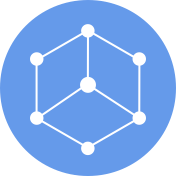 |Bibox | <a href="//doc.stocksharp.com/topics/api/connectors/crypto_exchanges/bibox.html" target="_blank">Docs</a> |
| |Binance | <a href="//doc.stocksharp.com/topics/api/connectors/crypto_exchanges/binance.html" target="_blank">Docs</a> |
|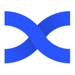 |BingX | <a href="//doc.stocksharp.com/topics/api/connectors/crypto_exchanges/bingx.html" target="_blank">Docs</a> |
| |Bitalong | <a href="https://doc.stocksharp.com/topics/api/connectors/crypto_exchanges/bitalong.html" target="_blank">Docs</a> |
| |Bitbank | <a href="//doc.stocksharp.com/topics/api/connectors/crypto_exchanges/bitbank.html" target="_blank">Docs</a> |
| |Bitget | <a href="//doc.stocksharp.com/topics/api/connectors/crypto_exchanges/bitget.html" target="_blank">Docs</a> |
| |Bitexbook | <a href="//doc.stocksharp.com/topics/api/connectors/crypto_exchanges/bitexbook.html" target="_blank">Docs</a> |
| |Bitfinex | <a href="//doc.stocksharp.com/topics/api/connectors/crypto_exchanges/bitfinex.html" target="_blank">Docs</a> |
| |Bithumb | <a href="//doc.stocksharp.com/topics/api/connectors/crypto_exchanges/bithumb.html" target="_blank">Docs</a> |
| |BitMax | <a href="//doc.stocksharp.com/topics/api/connectors/crypto_exchanges/bitmax.html" target="_blank">Docs</a> |
| |BitMEX | <a href="//doc.stocksharp.com/topics/api/connectors/crypto_exchanges/bitmex.html" target="_blank">Docs</a> |
| |BitStamp | <a href="//doc.stocksharp.com/topics/api/connectors/crypto_exchanges/bitstamp.html" target="_blank">Docs</a> |
| |Bittrex | <a href="//doc.stocksharp.com/topics/api/connectors/crypto_exchanges/bittrex.html" target="_blank">Docs</a> |
| |BitZ | <a href="//doc.stocksharp.com/topics/api/connectors/crypto_exchanges/bitz.html" target="_blank">Docs</a> |
|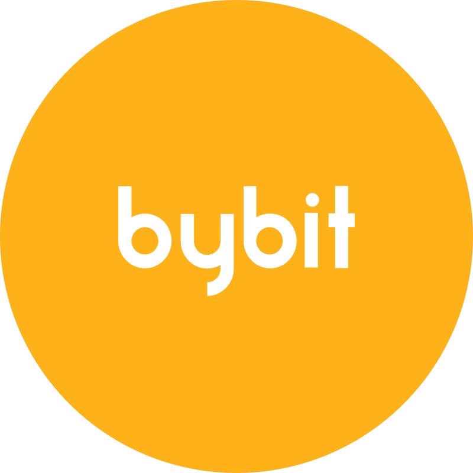 |ByBit | <a href="//doc.stocksharp.com/topics/api/connectors/crypto_exchanges/bybit.html" target="_blank">Docs</a> |
|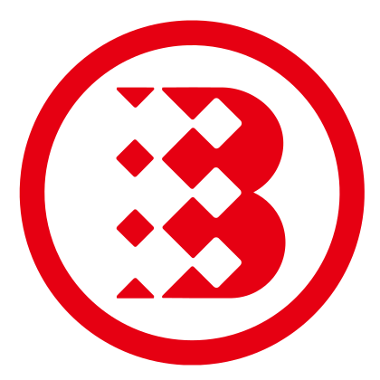 |BW | <a href="//doc.stocksharp.com/topics/api/connectors/crypto_exchanges/bw.html" target="_blank">Docs</a> |
|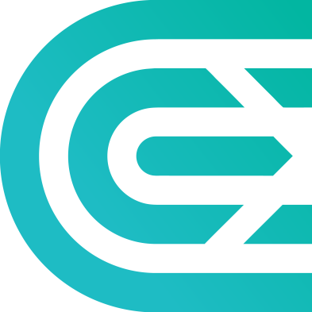 |CEX.IO | <a href="//doc.stocksharp.com/topics/api/connectors/crypto_exchanges/cex.io.html" target="_blank">Docs</a> |
|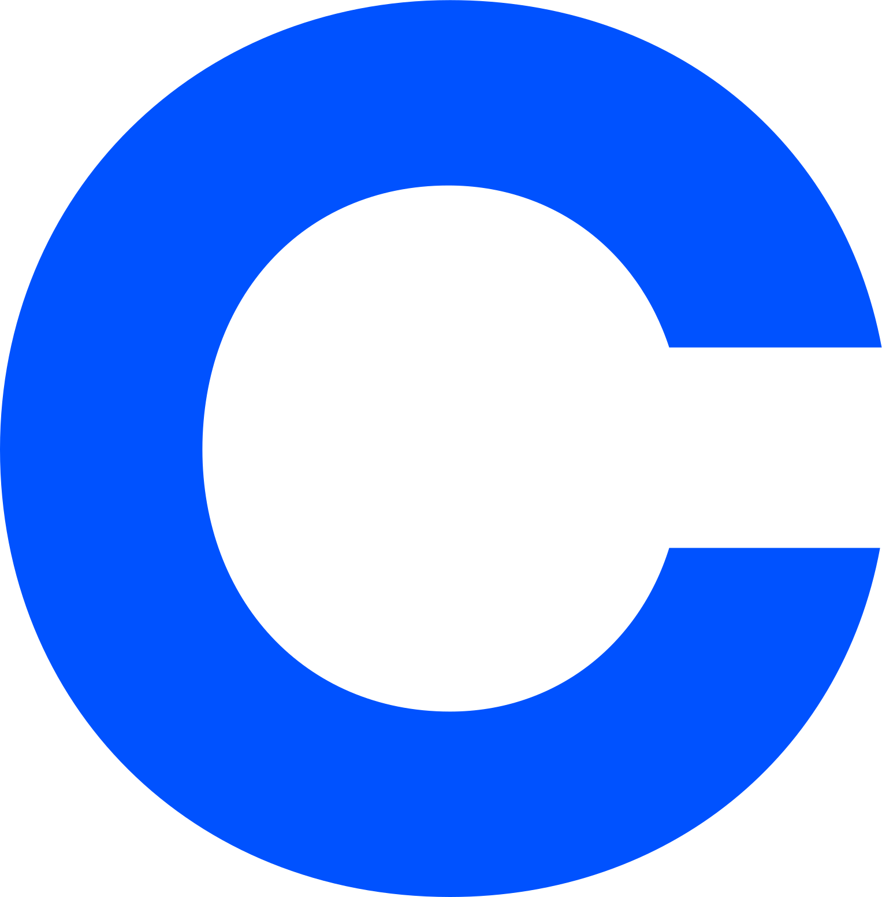 |Coinbase | <a href="//doc.stocksharp.com/topics/api/connectors/crypto_exchanges/coinbase.html" target="_blank">Docs</a> |
| |CoinBene | <a href="//doc.stocksharp.com/topics/api/connectors/crypto_exchanges/coinbene.html" target="_blank">Docs</a> |
| |CoinCap | <a href="//doc.stocksharp.com/topics/api/connectors/crypto_exchanges/coincap.html" target="_blank">Docs</a> |
|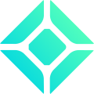 |Coincheck | <a href="//doc.stocksharp.com/topics/api/connectors/crypto_exchanges/coincheck.html" target="_blank">Docs</a> |
| |CoinEx | <a href="//doc.stocksharp.com/topics/api/connectors/crypto_exchanges/coinex.html" target="_blank">Docs</a> |
| |CoinExchange | <a href="//doc.stocksharp.com/topics/api/connectors/crypto_exchanges/coinexchange.html" target="_blank">Docs</a> |
|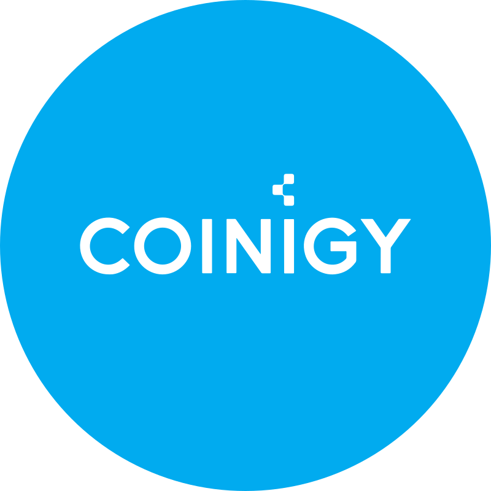 |Coinigy  | <a href="//doc.stocksharp.com/topics/api/connectors/crypto_exchanges/coinigy.html" target="_blank">Docs</a> |
|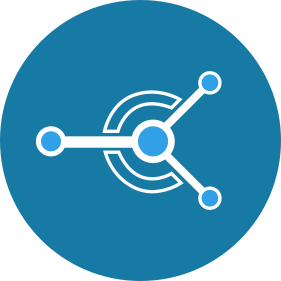 |CoinHub | <a href="//doc.stocksharp.com/topics/api/connectors/crypto_exchanges/coinhub.html" target="_blank">Docs</a> |
|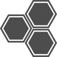 |Cryptopia | <a href="//doc.stocksharp.com/topics/api/connectors/crypto_exchanges/cryptopia.html" target="_blank">Docs</a> |
|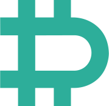 |Deribit | <a href="//doc.stocksharp.com/topics/api/connectors/crypto_exchanges/deribit.html" target="_blank">Docs</a> |
| |DigiFinex | <a href="//doc.stocksharp.com/topics/api/connectors/crypto_exchanges/digifinex.html" target="_blank">Docs</a> |
|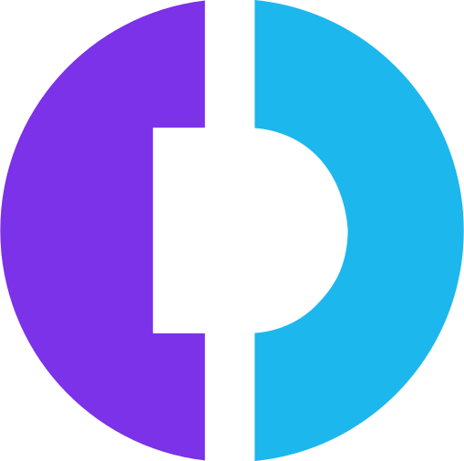 |DigitexFutures | <a href="https://doc.stocksharp.com/topics/api/connectors/crypto_exchanges/digitexfutures.html" target="_blank">Docs</a> |
| |EXMO | <a href="//doc.stocksharp.com/topics/api/connectors/crypto_exchanges/exmo.html" target="_blank">Docs</a> |
| |FatBTC | <a href="//doc.stocksharp.com/topics/api/connectors/crypto_exchanges/fatbtc.html" target="_blank">Docs</a> |
|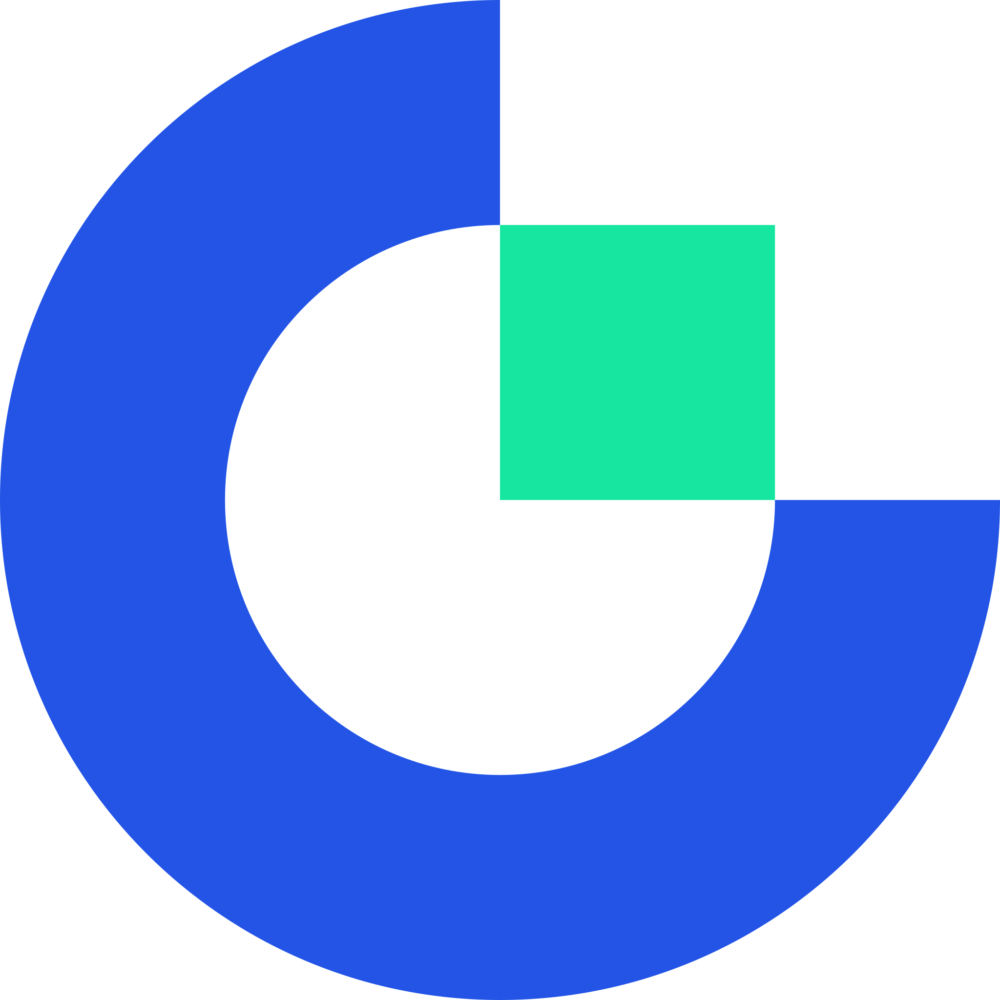 |GateIO | <a href="//doc.stocksharp.com/topics/api/connectors/crypto_exchanges/gateio.html" target="_blank">Docs</a> |
| |GDAX | <a href="//doc.stocksharp.com/topics/api/connectors/crypto_exchanges/gdax.html" target="_blank">Docs</a> |
|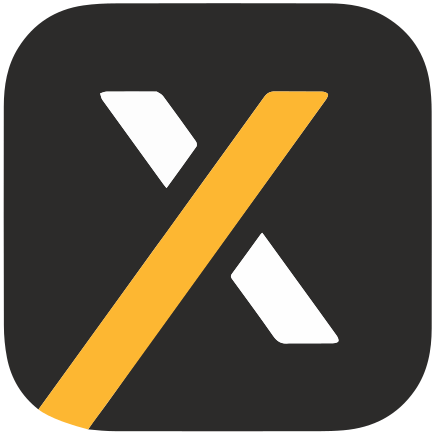 |GOPAX | <a href="//doc.stocksharp.com/topics/api/connectors/crypto_exchanges/gopax.html" target="_blank">Docs</a> |
| |HitBTC | <a href="//doc.stocksharp.com/topics/api/connectors/crypto_exchanges/hitbtc.html" target="_blank">Docs</a> |
|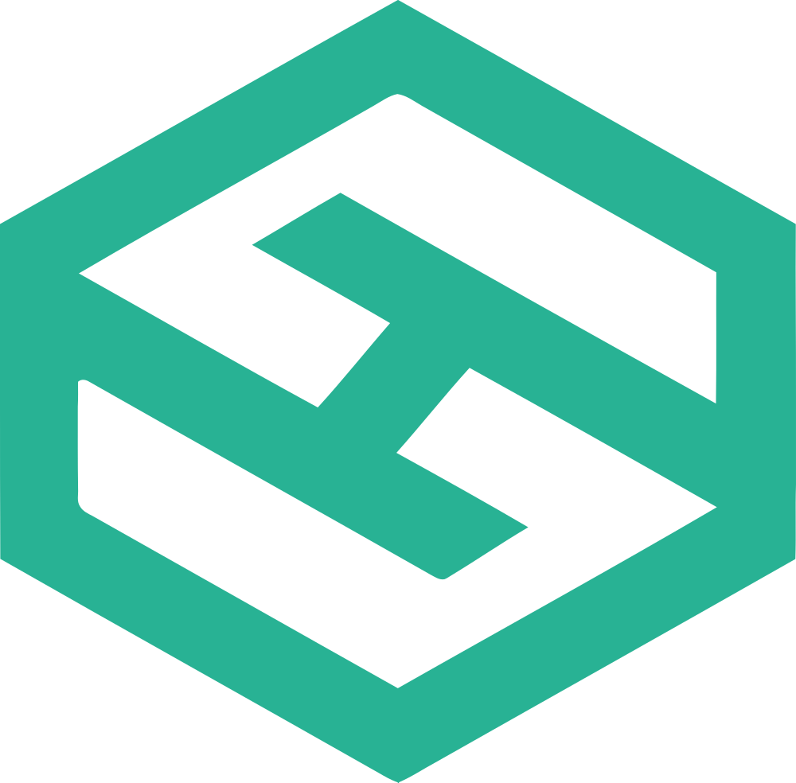 |Hotbit | <a href="//doc.stocksharp.com/topics/api/connectors/crypto_exchanges/hotbit.html" target="_blank">Docs</a> |
| |Huobi | <a href="//doc.stocksharp.com/topics/api/connectors/crypto_exchanges/huobi.html" target="_blank">Docs</a> |
|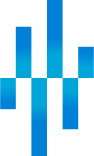 |IDAX | <a href="//doc.stocksharp.com/topics/api/connectors/crypto_exchanges/idax.html" target="_blank">Docs</a> |
| |Kraken | <a href="//doc.stocksharp.com/topics/api/connectors/crypto_exchanges/kraken.html" target="_blank">Docs</a> |
|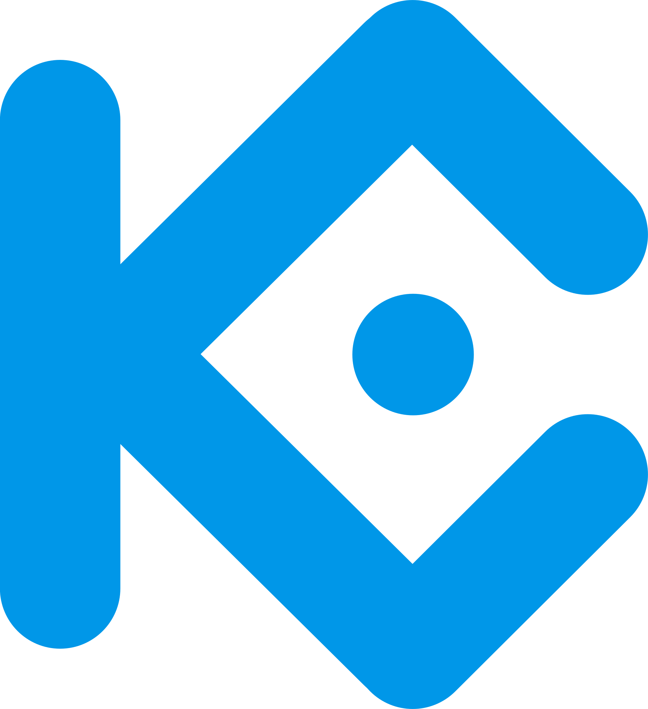 |KuCoin | <a href="//doc.stocksharp.com/topics/api/connectors/crypto_exchanges/kucoin.html" target="_blank">Docs</a> |
|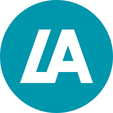 |LATOKEN | <a href="//doc.stocksharp.com/topics/api/connectors/crypto_exchanges/latoken.html" target="_blank">Docs</a> |
| |LBank | <a href="//doc.stocksharp.com/topics/api/connectors/crypto_exchanges/lbank.html" target="_blank">Docs</a> |
| |Liqui | <a href="//doc.stocksharp.com/topics/api/connectors/crypto_exchanges/liqui.html" target="_blank">Docs</a> |
|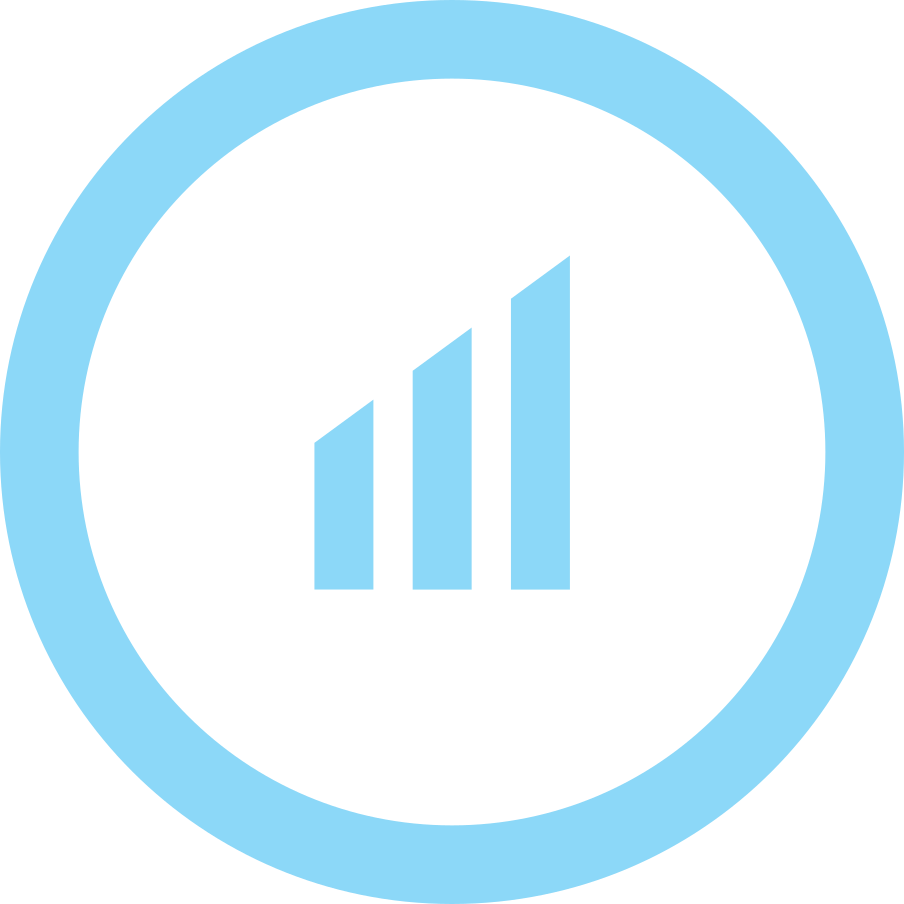 |Livecoin | <a href="//doc.stocksharp.com/topics/api/connectors/crypto_exchanges/livecoin.html" target="_blank">Docs</a> |
|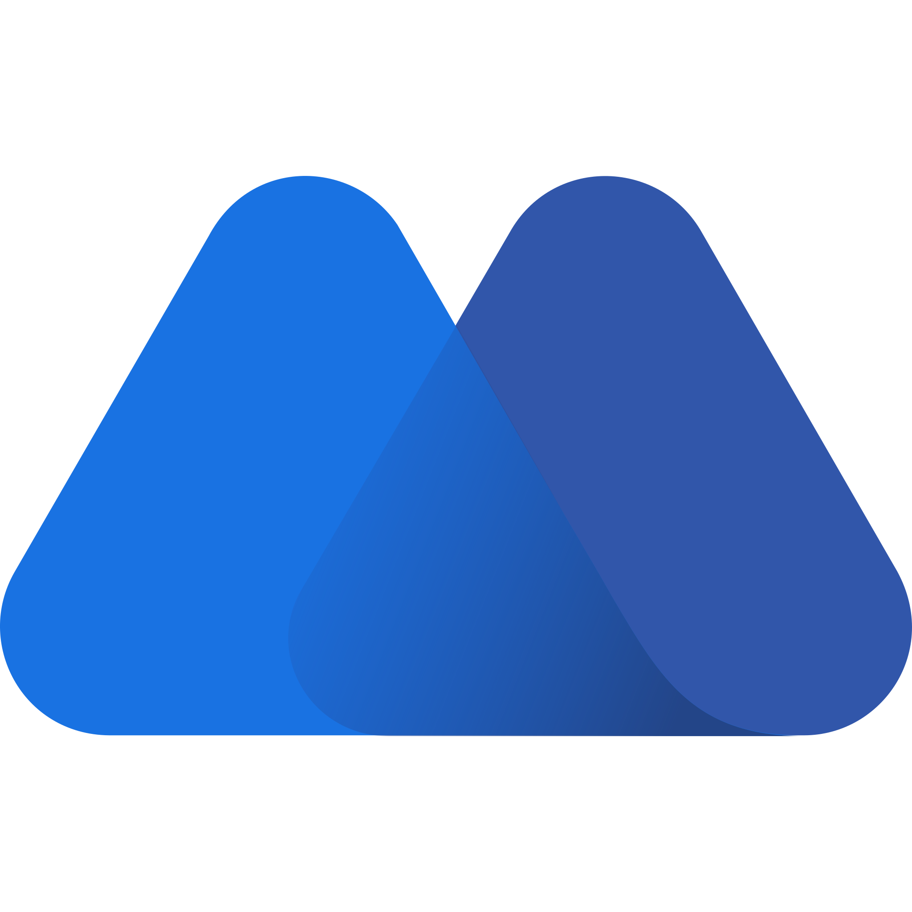 |MEXC | <a href="//doc.stocksharp.com/topics/api/connectors/crypto_exchanges/mexc.html" target="_blank">Docs</a> |
|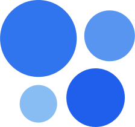 |OKCoin | <a href="//doc.stocksharp.com/topics/api/connectors/crypto_exchanges/okcoin.html" target="_blank">Docs</a> |
|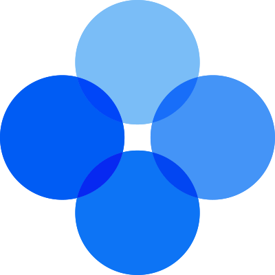 |OKEx | <a href="//doc.stocksharp.com/topics/api/connectors/crypto_exchanges/okex.html" target="_blank">Docs</a> |
|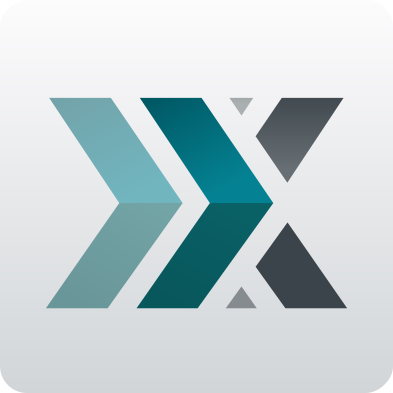 |Poloniex | <a href="//doc.stocksharp.com/topics/api/connectors/crypto_exchanges/poloniex.html" target="_blank">Docs</a> |
|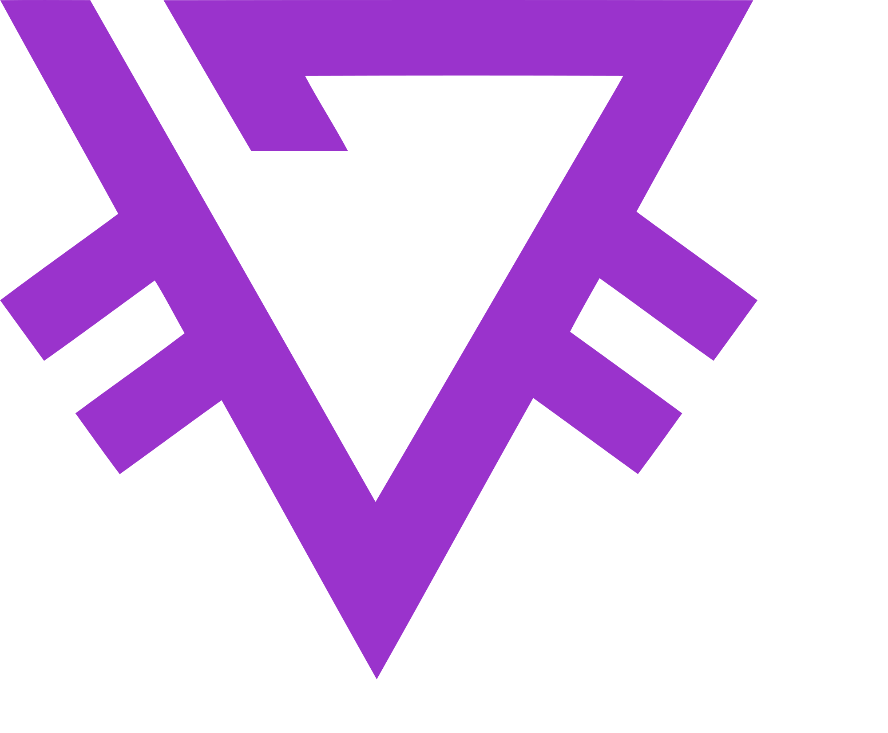 |PrizmBit | <a href="https://doc.stocksharp.com/topics/api/connectors/crypto_exchanges/prizmbit.html" target="_blank">Docs</a> |
|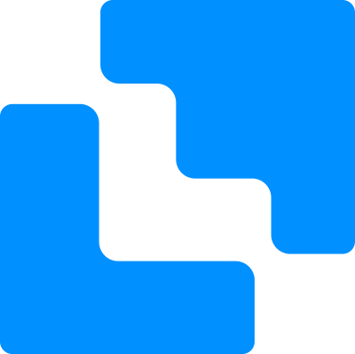 |QuoineX | <a href="//doc.stocksharp.com/topics/api/connectors/crypto_exchanges/quoinex.html" target="_blank">Docs</a> |
| |TradeOgre | <a href="//doc.stocksharp.com/topics/api/connectors/crypto_exchanges/tradeogre.html" target="_blank">Docs</a> |
| |Upbit | <a href="//doc.stocksharp.com/topics/api/connectors/crypto_exchanges/upbit.html" target="_blank">Docs</a> |
|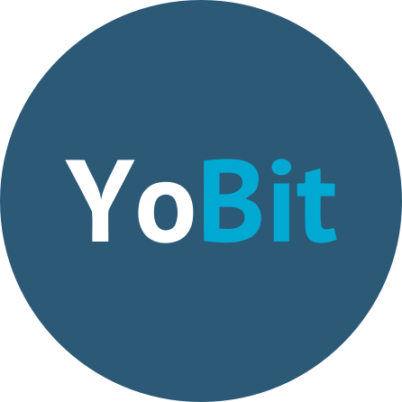 |YoBit | <a href="//doc.stocksharp.com/topics/api/connectors/crypto_exchanges/yobit.html" target="_blank">Docs</a> |
| |Zaif | <a href="//doc.stocksharp.com/topics/api/connectors/crypto_exchanges/zaif.html" target="_blank">Docs</a> |
| |ZB | <a href="//doc.stocksharp.com/topics/api/connectors/crypto_exchanges/zb.html" target="_blank">Docs</a> |

## DEX取引所
|ロゴ | 名称 | ドキュメント |
|:---:|:----:|:-------------:|
| |Aster | <a href="//doc.stocksharp.com/topics/api/connectors/crypto_exchanges/aster.html" target="_blank">Docs</a> |
| |edgeX | <a href="//doc.stocksharp.com/topics/api/connectors/crypto_exchanges/edgex.html" target="_blank">Docs</a> |
| |Ligther | <a href="//doc.stocksharp.com/topics/api/connectors/crypto_exchanges/ligther.html" target="_blank">Docs</a> |
| |Paradex | <a href="//doc.stocksharp.com/topics/api/connectors/crypto_exchanges/paradex.html" target="_blank">Docs</a> |
|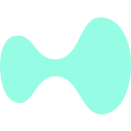 |Hyperliquid | <a href="//doc.stocksharp.com/topics/api/connectors/crypto_exchanges/hyperliquid.html" target="_blank">Docs</a> |

## 株式・先物・オプション
|ロゴ | 名称 | ドキュメント |
|:---:|:----:|:-------------:|
|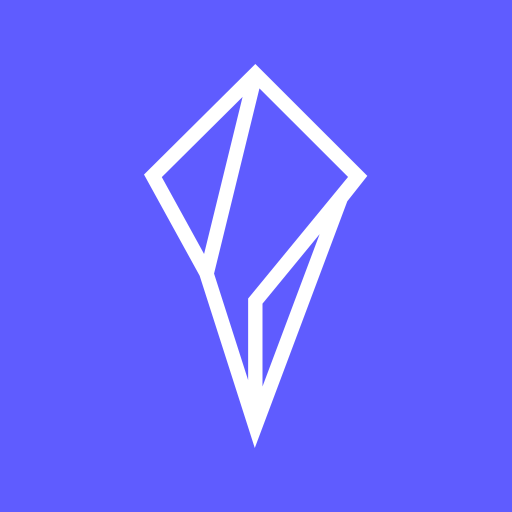 |Polygon.io | <a href="//doc.stocksharp.com/topics/api/connectors/stock_market/polygonio.html" target="_blank">Docs</a> |
| |Alpaca.Markets | <a href="//doc.stocksharp.com/topics/api/connectors/stock_market/alpaca.html" target="_blank">Docs</a> |
| |Interactive Brokers | <a href="//doc.stocksharp.com/topics/api/connectors/stock_market/interactive_brokers.html" target="_blank">Docs</a> |
|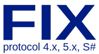 |FIXプロトコル (4.2, 4.4. 5.0) | <a href="//doc.stocksharp.com/topics/api/connectors/stock_market/fix_protocol.html" target="_blank">Docs</a> |
| |FASTプロトコル | <a href="//doc.stocksharp.com/topics/api/connectors/common/fast_protocol.html" target="_blank">Docs</a> |
| |BVMT | <a href="//doc.stocksharp.com/topics/api/connectors/stock_market/bvmt.html" target="_blank">Docs</a> |
| |AlphaVantage | <a href="//doc.stocksharp.com/topics/api/connectors/stock_market/alphavantage.html" target="_blank">Docs</a> |
| |BarChart | <a href="//doc.stocksharp.com/topics/api/connectors/stock_market/barchart.html" target="_blank">Docs</a> |
|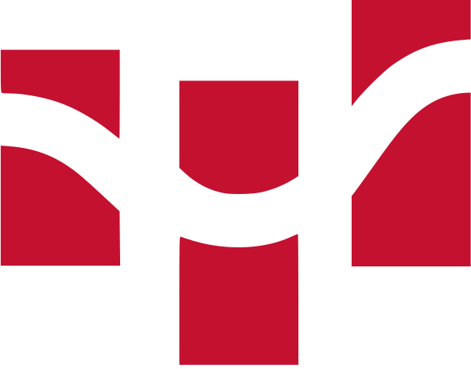 |CQG | <a href="//doc.stocksharp.com/topics/api/connectors/stock_market/cqg.html" target="_blank">Docs</a> |
|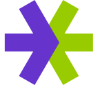 |E*TRADE | <a href="//doc.stocksharp.com/topics/api/connectors/stock_market/e_trade.html" target="_blank">Docs</a> |
| |Google | <a href="//doc.stocksharp.com/topics/api/connectors/stock_market/google.html" target="_blank">Docs</a> |
| |IEX | <a href="//doc.stocksharp.com/topics/api/connectors/stock_market/iex.html" target="_blank">Docs</a> |
| |IQFeed | <a href="//doc.stocksharp.com/topics/api/connectors/stock_market/iqfeed.html" target="_blank">Docs</a> |
| |ITCH | <a href="//doc.stocksharp.com/topics/api/connectors/stock_market/itch.html" target="_blank">Docs</a> |
| |OpenECry | <a href="//doc.stocksharp.com/topics/api/connectors/stock_market/openecry.html" target="_blank">Docs</a> |
| |Quandl | <a href="//doc.stocksharp.com/topics/api/connectors/stock_market/quandl.html" target="_blank">Docs</a> |
| |QuantFEED | <a href="//doc.stocksharp.com/topics/api/connectors/stock_market/quantfeed.html" target="_blank">Docs</a> |
| |Rithmic | <a href="//doc.stocksharp.com/topics/api/connectors/stock_market/rithmic.html" target="_blank">Docs</a> |
| |Sterling | <a href="//doc.stocksharp.com/topics/api/connectors/stock_market/sterling.html" target="_blank">Docs</a> |
| |Tradier | <a href="//doc.stocksharp.com/topics/api/connectors/stock_market/tradier.html" target="_blank">Docs</a> |
| |Xignite | <a href="//doc.stocksharp.com/topics/api/connectors/stock_market/xignite.html" target="_blank">Docs</a> |
|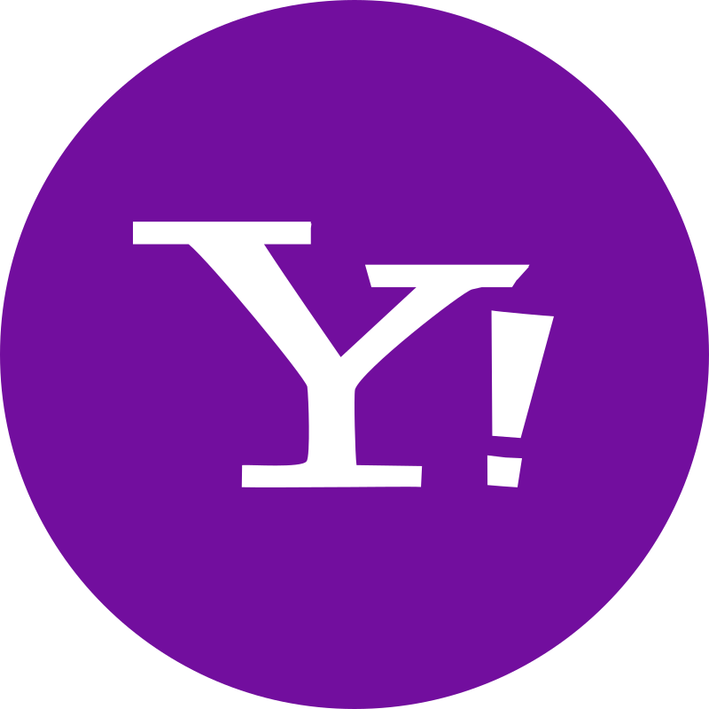 |Yahoo | <a href="//doc.stocksharp.com/topics/api/connectors/stock_market/yahoo.html" target="_blank">Docs</a> |
|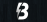 |Blackwood (Fusion) | <a href="//doc.stocksharp.com/topics/api/connectors/stock_market/blackwood_fusion.html" target="_blank">Docs</a> |


## FX（外国為替）
|ロゴ | 名称 | ドキュメント |
|:---:|:----:|:-------------:|
| |DXtrade | <a href="//doc.stocksharp.com/topics/api/connectors/forex/dxtrade.html" target="_blank">Docs</a> |
| |cTrader | <a href="//doc.stocksharp.com/topics/api/connectors/forex/ctrader.html" target="_blank">Docs</a> |
| |MT4 | <a href="//doc.stocksharp.com/topics/api/connectors/forex/metatrader.html" target="_blank">Docs</a> |
| |MT5 | <a href="//doc.stocksharp.com/topics/api/connectors/forex/metatrader.html" target="_blank">Docs</a> |
| |DukasCopy | <a href="//doc.stocksharp.com/topics/api/connectors/forex/dukascopy.html" target="_blank">Docs</a> |
| |FXCM | <a href="//doc.stocksharp.com/topics/api/connectors/forex/fxcm.html" target="_blank">Docs</a> |
|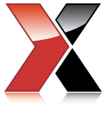 |LMAX | <a href="//doc.stocksharp.com/topics/api/connectors/forex/lmax.html" target="_blank">Docs</a> |
| |Oanda | <a href="//doc.stocksharp.com/topics/api/connectors/forex/oanda.html" target="_blank">Docs</a> |

  [1]: https://stocksharp.com
  [4]: https://stocksharp.com/edu/
  [5]: https://stocksharp.com/forum/
  [6]: https://stocksharp.com/broker/
  [8]: https://stocksharp.com/store/strategy-designer/
  [9]: https://stocksharp.com/store/market-data-downloader/
  [10]: https://stocksharp.com/store/trading-terminal/
  [11]: https://stocksharp.com/store/trading-shell/
  [12]: https://stocksharp.com/store/api/
