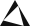
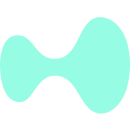

# [StockSharp - торговая платформа][1]

## [English](README.md) | **Русский** | [中文](README.zh.md)

## <a href="https://doc.stocksharp.ru" style="margin-right:15px;"> Документация</a> <a href="https://stocksharp.ru/products/download/" style="margin-right:15px;"> Скачать</a> <a href="https://t.me/stocksharpchat/1" style="margin-right:15px;"> Чат</a> <a href="https://vkvideo.ru/@stocksharp"> Видео</a>

## Введение ##

**StockSharp** (кратко **S#**) – это **бесплатная** платформа для торговли на любых рынках мира (криптобиржи, американские, европейские, азиатские, российские биржи акций, фьючерсов, опционов, Биткоин, форекс и т.д.). Вы сможете торговать вручную или автоматически (алгоритмические торговые роботы, обычные или высокочастотные HFT).

**Доступные подключения**: Binance, MT4, MT5, FIX/FAST, PolygonIO, Trading Technologies, Alpaca Markets, BarChart, CQG, E*Trade, IQFeed, InteractiveBrokers, LMAX, MatLab, Oanda, FXCM, Rithmic, cTrader, DXtrade, BitStamp, Bitfinex, Coinbase, Kraken, Poloniex, GDAX, Bittrex, Bithumb, OKX, Coincheck, CEX.IO, BitMEX, YoBit, Livecoin, EXMO, Deribit, HTX, KuCoin, QuantFEED, Aster, edgeX, Ligther, Paradex, Hyperliquid и многие другие.

## [Designer][8]


**Designer** - **бесплатное** универсальное приложение для создания алгоритмических стратегий:
  - Визуальный конструктор для создания стратегий кликами мыши
  - Встроенный редактор C#
  - Простое создание собственных индикаторов
  - Встроенный отладчик
  - Подключения к множеству электронных площадок и брокеров
  - Все мировые площадки
  - Обмен схемами с командой

## [Hydra][9]


**Hydra** - **бесплатное** ПО для автоматической загрузки и хранения рыночных данных:
  - Поддержка множества источников
  - Высокая степень сжатия
  - Любые типы данных
  - Программный доступ к сохраненным данным через API
  - Экспорт в csv, excel, xml или базу данных
  - Импорт из csv
  - Запланированные задачи
  - Автосинхронизация через Интернет между несколькими экземплярами Hydra

## [Terminal][10]


**Terminal** - **бесплатное** приложение для торговли с графиками (торговый терминал):
  - Подключения к множеству электронных площадок и брокеров
  - Торговля с графиков кликами
  - Произвольные таймфреймы
  - Свечи Volume, Tick, Range, P&F, Renko
  - Кластерные графики
  - Box графики
  - Volume Profile

## [Shell][11]


**Shell** - готовый графический фреймворк с возможностью быстрой настройки под ваши нужды и с полностью открытым исходным кодом на C#:
  - Полный исходный код
  - Поддержка всех подключений платформы StockSharp
  - Поддержка схем Designer
  - Гибкий пользовательский интерфейс
  - Тестирование стратегий (статистика, эквити, отчеты)
  - Сохранение и загрузка настроек стратегий
  - Запуск стратегий параллельно
  - Детальная информация о производительности стратегий
  - Запуск стратегий по расписанию

## [API][12]
API - это **бесплатная** библиотека C# для программистов, использующих Visual Studio. API позволяет создавать любые торговые стратегии, от долгосрочных позиционных стратегий до высокочастотных стратегий (HFT) с прямым доступом к бирже (DMA). [Подробнее...][12]

### Пример коннектора
```C#
var connector = new Connector();
var security = connector.LookupById("AAPL@NASDAQ");

var subscription = new Subscription(DataType.TimeFrame(TimeSpan.FromMinutes(1)), security);

connector.CandleReceived += (sub, candle) =>
{
        if (sub != subscription || candle.State != CandleStates.Finished)
                return;

        // определяем цвет свечи
        var isGreen = candle.ClosePrice > candle.OpenPrice;

        // регистрируем рыночную заявку в зависимости от цвета свечи
        var order = new Order
        {
                Security = security,
                Type = OrderTypes.Market,
                Side = isGreen ? Sides.Buy : Sides.Sell,
                Volume = 1
        };

        connector.RegisterOrder(order);
};

connector.Subscribe(subscription);
connector.Connect();
```

## Криптобиржи
|Лого | Название | Документация |
|:---:|:--------:|:------------:|
| |Bibox | <a href="https://doc.stocksharp.ru/topics/api/connectors/crypto_exchanges/bibox.html" target="_blank">Docs</a> |
| |Binance | <a href="https://doc.stocksharp.ru/topics/api/connectors/crypto_exchanges/binance.html" target="_blank">Docs</a> |
| |BingX | <a href="https://doc.stocksharp.ru/topics/api/connectors/crypto_exchanges/bingx.html" target="_blank">Docs</a> |
| |Bitalong | <a href="https://doc.stocksharp.ru/topics/api/connectors/crypto_exchanges/bitalong.html" target="_blank">Docs</a> |
| |Bitbank | <a href="https://doc.stocksharp.ru/topics/api/connectors/crypto_exchanges/bitbank.html" target="_blank">Docs</a> |
| |Bitget | <a href="https://doc.stocksharp.ru/topics/api/connectors/crypto_exchanges/bitget.html" target="_blank">Docs</a> |
| |Bitexbook | <a href="https://doc.stocksharp.ru/topics/api/connectors/crypto_exchanges/bitexbook.html" target="_blank">Docs</a> |
| |Bitfinex | <a href="https://doc.stocksharp.ru/topics/api/connectors/crypto_exchanges/bitfinex.html" target="_blank">Docs</a> |
| |Bithumb | <a href="https://doc.stocksharp.ru/topics/api/connectors/crypto_exchanges/bithumb.html" target="_blank">Docs</a> |
| |BitMax | <a href="https://doc.stocksharp.ru/topics/api/connectors/crypto_exchanges/bitmax.html" target="_blank">Docs</a> |
| |BitMEX | <a href="https://doc.stocksharp.ru/topics/api/connectors/crypto_exchanges/bitmex.html" target="_blank">Docs</a> |
| |BitStamp | <a href="https://doc.stocksharp.ru/topics/api/connectors/crypto_exchanges/bitstamp.html" target="_blank">Docs</a> |
| |Bittrex | <a href="https://doc.stocksharp.ru/topics/api/connectors/crypto_exchanges/bittrex.html" target="_blank">Docs</a> |
| |BitZ | <a href="https://doc.stocksharp.ru/topics/api/connectors/crypto_exchanges/bitz.html" target="_blank">Docs</a> |
| |ByBit | <a href="https://doc.stocksharp.ru/topics/api/connectors/crypto_exchanges/bybit.html" target="_blank">Docs</a> |
| |BW | <a href="https://doc.stocksharp.ru/topics/api/connectors/crypto_exchanges/bw.html" target="_blank">Docs</a> |
| |CEX.IO | <a href="https://doc.stocksharp.ru/topics/api/connectors/crypto_exchanges/cex.io.html" target="_blank">Docs</a> |
| |Coinbase | <a href="https://doc.stocksharp.ru/topics/api/connectors/crypto_exchanges/coinbase.html" target="_blank">Docs</a> |
| |CoinBene | <a href="https://doc.stocksharp.ru/topics/api/connectors/crypto_exchanges/coinbene.html" target="_blank">Docs</a> |
| |CoinCap | <a href="https://doc.stocksharp.ru/topics/api/connectors/crypto_exchanges/coincap.html" target="_blank">Docs</a> |
| |Coincheck | <a href="https://doc.stocksharp.ru/topics/api/connectors/crypto_exchanges/coincheck.html" target="_blank">Docs</a> |
| |CoinEx | <a href="https://doc.stocksharp.ru/topics/api/connectors/crypto_exchanges/coinex.html" target="_blank">Docs</a> |
| |CoinExchange | <a href="https://doc.stocksharp.ru/topics/api/connectors/crypto_exchanges/coinexchange.html" target="_blank">Docs</a> |
| |Coinigy  | <a href="https://doc.stocksharp.ru/topics/api/connectors/crypto_exchanges/coinigy.html" target="_blank">Docs</a> |
| |CoinHub | <a href="https://doc.stocksharp.ru/topics/api/connectors/crypto_exchanges/coinhub.html" target="_blank">Docs</a> |
| |Cryptopia | <a href="https://doc.stocksharp.ru/topics/api/connectors/crypto_exchanges/cryptopia.html" target="_blank">Docs</a> |
| |Deribit | <a href="https://doc.stocksharp.ru/topics/api/connectors/crypto_exchanges/deribit.html" target="_blank">Docs</a> |
| |DigiFinex | <a href="https://doc.stocksharp.ru/topics/api/connectors/crypto_exchanges/digifinex.html" target="_blank">Docs</a> |
| |DigitexFutures | <a href="https://doc.stocksharp.ru/topics/api/connectors/crypto_exchanges/digitexfutures.html" target="_blank">Docs</a> |
| |EXMO | <a href="https://doc.stocksharp.ru/topics/api/connectors/crypto_exchanges/exmo.html" target="_blank">Docs</a> |
| |FatBTC | <a href="https://doc.stocksharp.ru/topics/api/connectors/crypto_exchanges/fatbtc.html" target="_blank">Docs</a> |
| |GateIO | <a href="https://doc.stocksharp.ru/topics/api/connectors/crypto_exchanges/gateio.html" target="_blank">Docs</a> |
| |GDAX | <a href="https://doc.stocksharp.ru/topics/api/connectors/crypto_exchanges/gdax.html" target="_blank">Docs</a> |
| |GOPAX | <a href="https://doc.stocksharp.ru/topics/api/connectors/crypto_exchanges/gopax.html" target="_blank">Docs</a> |
| |HitBTC | <a href="https://doc.stocksharp.ru/topics/api/connectors/crypto_exchanges/hitbtc.html" target="_blank">Docs</a> |
| |Hotbit | <a href="https://doc.stocksharp.ru/topics/api/connectors/crypto_exchanges/hotbit.html" target="_blank">Docs</a> |
| |Huobi | <a href="https://doc.stocksharp.ru/topics/api/connectors/crypto_exchanges/huobi.html" target="_blank">Docs</a> |
| |IDAX | <a href="https://doc.stocksharp.ru/topics/api/connectors/crypto_exchanges/idax.html" target="_blank">Docs</a> |
| |Kraken | <a href="https://doc.stocksharp.ru/topics/api/connectors/crypto_exchanges/kraken.html" target="_blank">Docs</a> |
| |KuCoin | <a href="https://doc.stocksharp.ru/topics/api/connectors/crypto_exchanges/kucoin.html" target="_blank">Docs</a> |
| |LATOKEN | <a href="https://doc.stocksharp.ru/topics/api/connectors/crypto_exchanges/latoken.html" target="_blank">Docs</a> |
| |LBank | <a href="https://doc.stocksharp.ru/topics/api/connectors/crypto_exchanges/lbank.html" target="_blank">Docs</a> |
| |Liqui | <a href="https://doc.stocksharp.ru/topics/api/connectors/crypto_exchanges/liqui.html" target="_blank">Docs</a> |
| |Livecoin | <a href="https://doc.stocksharp.ru/topics/api/connectors/crypto_exchanges/livecoin.html" target="_blank">Docs</a> |
| |MEXC | <a href="https://doc.stocksharp.ru/topics/api/connectors/crypto_exchanges/mexc.html" target="_blank">Docs</a> |
| |OKCoin | <a href="https://doc.stocksharp.ru/topics/api/connectors/crypto_exchanges/okcoin.html" target="_blank">Docs</a> |
| |OKEx | <a href="https://doc.stocksharp.ru/topics/api/connectors/crypto_exchanges/okex.html" target="_blank">Docs</a> |
| |Poloniex | <a href="https://doc.stocksharp.ru/topics/api/connectors/crypto_exchanges/poloniex.html" target="_blank">Docs</a> |
| |PrizmBit | <a href="https://doc.stocksharp.ru/topics/api/connectors/crypto_exchanges/prizmbit.html" target="_blank">Docs</a> |
| |QuoineX | <a href="https://doc.stocksharp.ru/topics/api/connectors/crypto_exchanges/quoinex.html" target="_blank">Docs</a> |
| |TradeOgre | <a href="https://doc.stocksharp.ru/topics/api/connectors/crypto_exchanges/tradeogre.html" target="_blank">Docs</a> |
| |Upbit | <a href="https://doc.stocksharp.ru/topics/api/connectors/crypto_exchanges/upbit.html" target="_blank">Docs</a> |
| |YoBit | <a href="https://doc.stocksharp.ru/topics/api/connectors/crypto_exchanges/yobit.html" target="_blank">Docs</a> |
| |Zaif | <a href="https://doc.stocksharp.ru/topics/api/connectors/crypto_exchanges/zaif.html" target="_blank">Docs</a> |
| |ZB | <a href="https://doc.stocksharp.ru/topics/api/connectors/crypto_exchanges/zb.html" target="_blank">Docs</a> |

## DEX exchanges
|Logo | Name | Documentation |
|:---:|:----:|:-------------:|
| |Aster | <a href="https://doc.stocksharp.ru/topics/api/connectors/crypto_exchanges/aster.html" target="_blank">Docs</a> |
| |edgeX | <a href="https://doc.stocksharp.ru/topics/api/connectors/crypto_exchanges/edgex.html" target="_blank">Docs</a> |
| |Ligther | <a href="https://doc.stocksharp.ru/topics/api/connectors/crypto_exchanges/ligther.html" target="_blank">Docs</a> |
| |Paradex | <a href="https://doc.stocksharp.ru/topics/api/connectors/crypto_exchanges/paradex.html" target="_blank">Docs</a> |
| |Hyperliquid | <a href="https://doc.stocksharp.ru/topics/api/connectors/crypto_exchanges/hyperliquid.html" target="_blank">Docs</a> |


## Акции, фьючерсы и опционы
|Лого | Название | Документация |
|:---:|:--------:|:------------:|
| |Polygon.io | <a href="https://doc.stocksharp.ru/topics/api/connectors/stock_market/polygonio.html" target="_blank">Docs</a> |
| |Alpaca.Markets | <a href="https://doc.stocksharp.ru/topics/api/connectors/stock_market/alpaca.html" target="_blank">Docs</a> |
| |Interactive Brokers | <a href="https://doc.stocksharp.ru/topics/api/connectors/stock_market/interactive_brokers.html" target="_blank">Docs</a> |
| |FIX protocol (4.2, 4.4. 5.0) | <a href="https://doc.stocksharp.ru/topics/api/connectors/stock_market/fix_protocol.html" target="_blank">Docs</a> |
| |FAST protocol | <a href="https://doc.stocksharp.ru/topics/api/connectors/common/fast_protocol.html" target="_blank">Docs</a> |
| |BVMT | <a href="https://doc.stocksharp.ru/topics/api/connectors/stock_market/bvmt.html" target="_blank">Docs</a> |
| |AlphaVantage | <a href="https://doc.stocksharp.ru/topics/api/connectors/stock_market/alphavantage.html" target="_blank">Docs</a> |
| |BarChart | <a href="https://doc.stocksharp.ru/topics/api/connectors/stock_market/barchart.html" target="_blank">Docs</a> |
| |CQG | <a href="https://doc.stocksharp.ru/topics/api/connectors/stock_market/cqg.html" target="_blank">Docs</a> |
| |E*TRADE | <a href="https://doc.stocksharp.ru/topics/api/connectors/stock_market/e_trade.html" target="_blank">Docs</a> |
| |Google | <a href="https://doc.stocksharp.ru/topics/api/connectors/stock_market/google.html" target="_blank">Docs</a> |
| |IEX | <a href="https://doc.stocksharp.ru/topics/api/connectors/stock_market/iex.html" target="_blank">Docs</a> |
| |IQFeed | <a href="https://doc.stocksharp.ru/topics/api/connectors/stock_market/iqfeed.html" target="_blank">Docs</a> |
| |ITCH | <a href="https://doc.stocksharp.ru/topics/api/connectors/stock_market/itch.html" target="_blank">Docs</a> |
| |OpenECry | <a href="https://doc.stocksharp.ru/topics/api/connectors/stock_market/openecry.html" target="_blank">Docs</a> |
| |Quandl | <a href="https://doc.stocksharp.ru/topics/api/connectors/stock_market/quandl.html" target="_blank">Docs</a> |
| |QuantFEED | <a href="https://doc.stocksharp.ru/topics/api/connectors/stock_market/quantfeed.html" target="_blank">Docs</a> |
| |Rithmic | <a href="https://doc.stocksharp.ru/topics/api/connectors/stock_market/rithmic.html" target="_blank">Docs</a> |
| |Sterling | <a href="https://doc.stocksharp.ru/topics/api/connectors/stock_market/sterling.html" target="_blank">Docs</a> |
| |Tradier | <a href="https://doc.stocksharp.ru/topics/api/connectors/stock_market/tradier.html" target="_blank">Docs</a> |
| |Xignite | <a href="https://doc.stocksharp.ru/topics/api/connectors/stock_market/xignite.html" target="_blank">Docs</a> |
| |Yahoo | <a href="https://doc.stocksharp.ru/topics/api/connectors/stock_market/yahoo.html" target="_blank">Docs</a> |
| |Blackwood (Fusion) | <a href="https://doc.stocksharp.ru/topics/api/connectors/stock_market/blackwood_fusion.html" target="_blank">Docs</a> |

## Российский рынок
|Лого | Название |  Документация Ru|
|:---:|:--------:|:---------------:|
| |Quik |  <a href="https://doc.stocksharp.ru/topics/api/connectors/russia/quik.html" target="_blank">Ru</a> |
| |Tinkoff |  <a href="https://doc.stocksharp.ru/topics/api/connectors/russia/tinkoff.html" target="_blank">Ru</a> |
| |Mfd | <a href="https://doc.stocksharp.ru/topics/api/connectors/russia/mfd.html" target="_blank">Ru</a> |
| |Micex (TEAP) | <a href="https://doc.stocksharp.ru/topics/api/connectors/russia/micex.html" target="_blank">Ru</a> |
| |Plaza II | <a href="https://doc.stocksharp.ru/topics/api/connectors/russia/plaza.html" target="_blank">Ru</a> |
| |Quik FIX |  <a href="https://doc.stocksharp.ru/topics/api/connectors/russia/quikfix.html" target="_blank">Ru</a> |
| |SmartCOM |  <a href="https://doc.stocksharp.ru/topics/api/connectors/russia/smartcom.html" target="_blank">Ru</a> |
| |SPB Exchange |  <a href="https://doc.stocksharp.ru/topics/api/connectors/russia/spb_exchange.html" target="_blank">Ru</a> |
| |Transaq |  <a href="https://doc.stocksharp.ru/topics/api/connectors/russia/transaq.html" target="_blank">Ru</a> |
| |Twime |  <a href="https://doc.stocksharp.ru/topics/api/connectors/russia/twime.html" target="_blank">Ru</a> |
| |UX (сайт) | <a href="https://doc.stocksharp.ru/topics/api/connectors/russia/ux.html" target="_blank">Ru</a> |
| |Алор История | <a href="https://doc.stocksharp.ru/topics/api/connectors/russia/alorhistory.html" target="_blank">Ru</a> |
| |Алор Брокер | <a href="https://doc.stocksharp.ru/topics/api/connectors/russia/alor.html" target="_blank">Ru</a> |
| |Альфа-Директ | <a href="https://doc.stocksharp.ru/topics/api/connectors/russia/alfadirect.html" target="_blank">Ru</a> |
| |ЛЧИ | <a href="https://doc.stocksharp.ru/topics/api/connectors/russia/lci.html" target="_blank">Ru</a> |
| |Финам | <a href="https://doc.stocksharp.ru/topics/api/connectors/russia/finam.html" target="_blank">Ru</a> |

## Форекс
|Лого | Название | Документация |
|:---:|:--------:|:------------:|
| |DXtrade | <a href="https://doc.stocksharp.ru/topics/api/connectors/forex/dxtrade.html" target="_blank">Docs</a> |
| |cTrader | <a href="https://doc.stocksharp.ru/topics/api/connectors/forex/ctrader.html" target="_blank">Docs</a> |
| |MT4 | <a href="https://doc.stocksharp.ru/topics/api/connectors/forex/metatrader.html" target="_blank">Docs</a> |
| |MT5 | <a href="https://doc.stocksharp.ru/topics/api/connectors/forex/metatrader.html" target="_blank">Docs</a> |
| |DukasCopy | <a href="https://doc.stocksharp.ru/topics/api/connectors/forex/dukascopy.html" target="_blank">Docs</a> |
| |FXCM | <a href="https://doc.stocksharp.ru/topics/api/connectors/forex/fxcm.html" target="_blank">Docs</a> |
| |LMAX | <a href="https://doc.stocksharp.ru/topics/api/connectors/forex/lmax.html" target="_blank">Docs</a> |
| |Oanda | <a href="https://doc.stocksharp.ru/topics/api/connectors/forex/oanda.html" target="_blank">Docs</a> |

  [1]: https://stocksharp.ru
  [4]: https://stocksharp.ru/edu/
  [5]: https://stocksharp.ru/forum/
  [6]: https://stocksharp.ru/broker/
  [8]: https://stocksharp.ru/store/strategy-designer/
  [9]: https://stocksharp.ru/store/market-data-downloader/
  [10]: https://stocksharp.ru/store/trading-terminal/
  [11]: https://stocksharp.ru/store/trading-shell/
  [12]: https://stocksharp.ru/store/api/