# [StockSharp - 交易平台][1]

## [English](README.md) | [Русский](README.ru.md) | **中文**

## <a href="https://doc.stocksharp.com/zh" style="margin-right:15px;"> 文档</a> <a href="https://stocksharp.com/zh/products/download/" style="margin-right:15px;"> 下载</a> <a href="https://stocksharp.com/zh/chat/" style="margin-right:15px;"> 聊天</a> <a href="https://www.youtube.com/@stocksharp_china"> YouTube</a>

## 介绍 ##

**StockSharp**（简称 **S#**）是一个**免费**的全球市场交易平台（加密货币交易所、美国、欧洲、亚洲、俄罗斯股票、期货、期权、比特币、外汇等）。您可以进行手动交易或自动交易（算法交易机器人、常规或高频交易 HFT）。

**可用连接**: Binance, MT4, MT5, FIX/FAST, PolygonIO, Trading Technologies, Alpaca Markets, BarChart, CQG, E*Trade, IQFeed, InteractiveBrokers, LMAX, MatLab, Oanda, FXCM, Rithmic, cTrader, DXtrade, BitStamp, Bitfinex, Coinbase, Kraken, Poloniex, GDAX, Bittrex, Bithumb, OKX, Coincheck, CEX.IO, BitMEX, YoBit, Livecoin, EXMO, Deribit, HTX, KuCoin, QuantFEED, Aster, edgeX, Ligther, Paradex, Hyperliquid 等等。

连接器源代码和完整连接器列表可在 [StockSharp Connectors 仓库](https://github.com/StockSharp/Connectors) 中找到。

## [Designer][8]


**Designer** - **免费**的通用算法策略应用程序，用于轻松创建策略：
  - 可视化设计器，通过鼠标点击创建策略
  - 内置 C# 编辑器
  - 轻松创建自己的指标
  - 内置调试器
  - 连接到多个电子交易所和经纪商
  - 全球所有平台
  - 与团队共享架构

## [Hydra][9]


**Hydra** - **免费**软件，用于自动加载和存储市场数据：
  - 支持多种数据源
  - 高压缩比
  - 任何数据类型
  - 通过 API 程序访问存储的数据
  - 导出到 csv、excel、xml 或数据库
  - 从 csv 导入
  - 计划任务
  - 通过互联网在多个 Hydra 实例之间自动同步

## [Terminal][10]


**Terminal** - **免费**交易图表应用程序（交易终端）：
  - 连接到多个电子交易所和经纪商
  - 通过点击图表进行交易
  - 任意时间框架
  - Volume、Tick、Range、P&F、Renko K线
  - 集群图表
  - Box 图表
  - 成交量分布

## [Shell][11]


**Shell** - 现成的图形框架，可以快速适应您的需求，具有完全开源的 C# 代码：
  - 完整源代码
  - 支持所有 StockSharp 平台连接
  - 支持 Designer 架构
  - 灵活的用户界面
  - 策略测试（统计、权益、报告）
  - 保存和加载策略设置
  - 并行启动策略
  - 策略性能的详细信息
  - 按计划启动策略

## [API][12]
API 是一个面向使用 Visual Studio 的程序员的**免费** C# 库。API 允许您创建任何交易策略，从长期持仓策略到直接访问交易所的高频策略 (HFT) (DMA)。[更多信息...][12]

### 连接器示例
```C#
var connector = new Connector();
var security = connector.LookupById("AAPL@NASDAQ");

var subscription = new Subscription(DataType.TimeFrame(TimeSpan.FromMinutes(1)), security);

connector.CandleReceived += (sub, candle) =>
{
        if (sub != subscription || candle.State != CandleStates.Finished)
                return;

        // 确定K线颜色
        var isGreen = candle.ClosePrice > candle.OpenPrice;

        // 根据K线颜色注册市价单
        var order = new Order
        {
                Security = security,
                Type = OrderTypes.Market,
                Side = isGreen ? Sides.Buy : Sides.Sell,
                Volume = 1
        };

        connector.RegisterOrder(order);
};

connector.Subscribe(subscription);
connector.Connect();
```

## 加密货币交易所
|图标 | 名称 | 文档|
|:---:|:----:|:------:|
| |Bibox | <a href="https://doc.stocksharp.com/zh/topics/api/connectors/crypto_exchanges/bibox.html" target="_blank">Docs</a> |
| |Binance | <a href="https://doc.stocksharp.com/zh/topics/api/connectors/crypto_exchanges/binance.html" target="_blank">Docs</a> |
| |BingX | <a href="https://doc.stocksharp.com/zh/topics/api/connectors/crypto_exchanges/bingx.html" target="_blank">Docs</a> |
| |Bitalong | <a href="https://doc.stocksharp.com/zh/topics/api/connectors/crypto_exchanges/bitalong.html" target="_blank">Docs</a> |
| |Bitbank | <a href="https://doc.stocksharp.com/zh/topics/api/connectors/crypto_exchanges/bitbank.html" target="_blank">Docs</a> |
| |Bitget | <a href="https://doc.stocksharp.com/zh/topics/api/connectors/crypto_exchanges/bitget.html" target="_blank">Docs</a> |
| |Bitexbook | <a href="https://doc.stocksharp.com/zh/topics/api/connectors/crypto_exchanges/bitexbook.html" target="_blank">Docs</a> |
| |Bitfinex | <a href="https://doc.stocksharp.com/zh/topics/api/connectors/crypto_exchanges/bitfinex.html" target="_blank">Docs</a> |
| |Bithumb | <a href="https://doc.stocksharp.com/zh/topics/api/connectors/crypto_exchanges/bithumb.html" target="_blank">Docs</a> |
| |BitMax | <a href="https://doc.stocksharp.com/zh/topics/api/connectors/crypto_exchanges/bitmax.html" target="_blank">Docs</a> |
| |BitMEX | <a href="https://doc.stocksharp.com/zh/topics/api/connectors/crypto_exchanges/bitmex.html" target="_blank">Docs</a> |
| |BitStamp | <a href="https://doc.stocksharp.com/zh/topics/api/connectors/crypto_exchanges/bitstamp.html" target="_blank">Docs</a> |
| |Bittrex | <a href="https://doc.stocksharp.com/zh/topics/api/connectors/crypto_exchanges/bittrex.html" target="_blank">Docs</a> |
| |BitZ | <a href="https://doc.stocksharp.com/zh/topics/api/connectors/crypto_exchanges/bitz.html" target="_blank">Docs</a> |
| |ByBit | <a href="https://doc.stocksharp.com/zh/topics/api/connectors/crypto_exchanges/bybit.html" target="_blank">Docs</a> |
| |BW | <a href="https://doc.stocksharp.com/zh/topics/api/connectors/crypto_exchanges/bw.html" target="_blank">Docs</a> |
| |CEX.IO | <a href="https://doc.stocksharp.com/zh/topics/api/connectors/crypto_exchanges/cex.io.html" target="_blank">Docs</a> |
| |Coinbase | <a href="https://doc.stocksharp.com/zh/topics/api/connectors/crypto_exchanges/coinbase.html" target="_blank">Docs</a> |
| |CoinBene | <a href="https://doc.stocksharp.com/zh/topics/api/connectors/crypto_exchanges/coinbene.html" target="_blank">Docs</a> |
| |CoinCap | <a href="https://doc.stocksharp.com/zh/topics/api/connectors/crypto_exchanges/coincap.html" target="_blank">Docs</a> |
| |Coincheck | <a href="https://doc.stocksharp.com/zh/topics/api/connectors/crypto_exchanges/coincheck.html" target="_blank">Docs</a> |
| |CoinEx | <a href="https://doc.stocksharp.com/zh/topics/api/connectors/crypto_exchanges/coinex.html" target="_blank">Docs</a> |
| |CoinExchange | <a href="https://doc.stocksharp.com/zh/topics/api/connectors/crypto_exchanges/coinexchange.html" target="_blank">Docs</a> |
| |Coinigy  | <a href="https://doc.stocksharp.com/zh/topics/api/connectors/crypto_exchanges/coinigy.html" target="_blank">Docs</a> |
| |CoinHub | <a href="https://doc.stocksharp.com/zh/topics/api/connectors/crypto_exchanges/coinhub.html" target="_blank">Docs</a> |
| |Crypto.com Exchange | <a href="https://doc.stocksharp.com/zh/topics/api/connectors/crypto_exchanges/crypto_com.html" target="_blank">Docs</a> |
| |Cryptopia | <a href="https://doc.stocksharp.com/zh/topics/api/connectors/crypto_exchanges/cryptopia.html" target="_blank">Docs</a> |
| |Deribit | <a href="https://doc.stocksharp.com/zh/topics/api/connectors/crypto_exchanges/deribit.html" target="_blank">Docs</a> |
| |DigiFinex | <a href="https://doc.stocksharp.com/zh/topics/api/connectors/crypto_exchanges/digifinex.html" target="_blank">Docs</a> |
| |DigitexFutures | <a href="https://doc.stocksharp.com/zh/topics/api/connectors/crypto_exchanges/digitexfutures.html" target="_blank">Docs</a> |
| |EXMO | <a href="https://doc.stocksharp.com/zh/topics/api/connectors/crypto_exchanges/exmo.html" target="_blank">Docs</a> |
| |FatBTC | <a href="https://doc.stocksharp.com/zh/topics/api/connectors/crypto_exchanges/fatbtc.html" target="_blank">Docs</a> |
| |GateIO | <a href="https://doc.stocksharp.com/zh/topics/api/connectors/crypto_exchanges/gateio.html" target="_blank">Docs</a> |
| |GDAX | <a href="https://doc.stocksharp.com/zh/topics/api/connectors/crypto_exchanges/gdax.html" target="_blank">Docs</a> |
| |GOPAX | <a href="https://doc.stocksharp.com/zh/topics/api/connectors/crypto_exchanges/gopax.html" target="_blank">Docs</a> |
| |HitBTC | <a href="https://doc.stocksharp.com/zh/topics/api/connectors/crypto_exchanges/hitbtc.html" target="_blank">Docs</a> |
| |Hotbit | <a href="https://doc.stocksharp.com/zh/topics/api/connectors/crypto_exchanges/hotbit.html" target="_blank">Docs</a> |
| |Huobi | <a href="https://doc.stocksharp.com/zh/topics/api/connectors/crypto_exchanges/huobi.html" target="_blank">Docs</a> |
| |IDAX | <a href="https://doc.stocksharp.com/zh/topics/api/connectors/crypto_exchanges/idax.html" target="_blank">Docs</a> |
| |Kraken | <a href="https://doc.stocksharp.com/zh/topics/api/connectors/crypto_exchanges/kraken.html" target="_blank">Docs</a> |
| |KuCoin | <a href="https://doc.stocksharp.com/zh/topics/api/connectors/crypto_exchanges/kucoin.html" target="_blank">Docs</a> |
| |LATOKEN | <a href="https://doc.stocksharp.com/zh/topics/api/connectors/crypto_exchanges/latoken.html" target="_blank">Docs</a> |
| |LBank | <a href="https://doc.stocksharp.com/zh/topics/api/connectors/crypto_exchanges/lbank.html" target="_blank">Docs</a> |
| |Liqui | <a href="https://doc.stocksharp.com/zh/topics/api/connectors/crypto_exchanges/liqui.html" target="_blank">Docs</a> |
| |Livecoin | <a href="https://doc.stocksharp.com/zh/topics/api/connectors/crypto_exchanges/livecoin.html" target="_blank">Docs</a> |
| |MEXC | <a href="https://doc.stocksharp.com/zh/topics/api/connectors/crypto_exchanges/mexc.html" target="_blank">Docs</a> |
| |OKCoin | <a href="https://doc.stocksharp.com/zh/topics/api/connectors/crypto_exchanges/okcoin.html" target="_blank">Docs</a> |
| |OKEx | <a href="https://doc.stocksharp.com/zh/topics/api/connectors/crypto_exchanges/okex.html" target="_blank">Docs</a> |
| |Poloniex | <a href="https://doc.stocksharp.com/zh/topics/api/connectors/crypto_exchanges/poloniex.html" target="_blank">Docs</a> |
| |PrizmBit | <a href="https://doc.stocksharp.com/zh/topics/api/connectors/crypto_exchanges/prizmbit.html" target="_blank">Docs</a> |
| |QuoineX | <a href="https://doc.stocksharp.com/zh/topics/api/connectors/crypto_exchanges/quoinex.html" target="_blank">Docs</a> |
| |TradeOgre | <a href="https://doc.stocksharp.com/zh/topics/api/connectors/crypto_exchanges/tradeogre.html" target="_blank">Docs</a> |
| |Upbit | <a href="https://doc.stocksharp.com/zh/topics/api/connectors/crypto_exchanges/upbit.html" target="_blank">Docs</a> |
| |YoBit | <a href="https://doc.stocksharp.com/zh/topics/api/connectors/crypto_exchanges/yobit.html" target="_blank">Docs</a> |
| |Zaif | <a href="https://doc.stocksharp.com/zh/topics/api/connectors/crypto_exchanges/zaif.html" target="_blank">Docs</a> |
| |ZB | <a href="https://doc.stocksharp.com/zh/topics/api/connectors/crypto_exchanges/zb.html" target="_blank">Docs</a> |

## DEX exchanges
|Logo | Name | Documentation |
|:---:|:----:|:-------------:|
| |Aster | <a href="https://doc.stocksharp.com/zh/topics/api/connectors/crypto_exchanges/aster.html" target="_blank">Docs</a> |
| |Toobit | <a href="https://doc.stocksharp.com/zh/topics/api/connectors/crypto_exchanges/toobit.html" target="_blank">Docs</a> |
| |WhiteBIT | <a href="https://doc.stocksharp.com/zh/topics/api/connectors/crypto_exchanges/whitebit.html" target="_blank">Docs</a> |
| |WEEX | <a href="https://doc.stocksharp.com/zh/topics/api/connectors/crypto_exchanges/weex.html" target="_blank">文档</a> |
| |CoinW | <a href="https://doc.stocksharp.com/zh/topics/api/connectors/crypto_exchanges/coinw.html" target="_blank">文档</a> |
| |Pionex | <a href="https://doc.stocksharp.com/zh/topics/api/connectors/crypto_exchanges/pionex.html" target="_blank">文档</a> |
|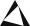 |edgeX | <a href="https://doc.stocksharp.com/zh/topics/api/connectors/crypto_exchanges/edgex.html" target="_blank">Docs</a> |
| |Ligther | <a href="https://doc.stocksharp.com/zh/topics/api/connectors/crypto_exchanges/ligther.html" target="_blank">Docs</a> |
| |Paradex | <a href="https://doc.stocksharp.com/zh/topics/api/connectors/crypto_exchanges/paradex.html" target="_blank">Docs</a> |
| |Hyperliquid | <a href="https://doc.stocksharp.com/zh/topics/api/connectors/crypto_exchanges/hyperliquid.html" target="_blank">Docs</a> |


*[所有加密货币交易所的完整列表 - 请参阅英文版 README](README.md#crypto-exchanges)*

## 股票、期货和期权
|图标 | 名称 | 文档|
|:---:|:----:|:------:|
| |Polygon.io | <a href="https://doc.stocksharp.com/zh/topics/api/connectors/stock_market/polygonio.html" target="_blank">Docs</a> |
| |Public.com | <a href="https://doc.stocksharp.com/zh/topics/api/connectors/stock_market/public.html" target="_blank">文档</a> |
| |Moomoo | <a href="https://doc.stocksharp.com/zh/topics/api/connectors/stock_market/moomoo.html" target="_blank">文档</a> |
| |NinjaTrader | <a href="https://doc.stocksharp.com/zh/topics/api/connectors/stock_market/ninjatrader.html" target="_blank">Docs</a> |
| |Lime Trader | <a href="https://doc.stocksharp.com/zh/topics/api/connectors/stock_market/lime.html" target="_blank">Docs</a> |
| |lemon.markets | <a href="https://doc.stocksharp.com/zh/topics/api/connectors/stock_market/lemon_markets.html" target="_blank">Docs</a> |
| |SnapTrade | <a href="https://doc.stocksharp.com/zh/topics/api/connectors/stock_market/snaptrade.html" target="_blank">Docs</a> |
| |OpenMarkets | <a href="https://doc.stocksharp.com/zh/topics/api/connectors/stock_market/openmarkets.html" target="_blank">Docs</a> |
| |Phillip POEMS | <a href="https://doc.stocksharp.com/zh/topics/api/connectors/stock_market/phillip_poems.html" target="_blank">文档</a> |
| |uSMART | <a href="https://doc.stocksharp.com/zh/topics/api/connectors/stock_market/usmart.html" target="_blank">文档</a> |
| |Alpaca.Markets | <a href="https://doc.stocksharp.com/zh/topics/api/connectors/stock_market/alpaca.html" target="_blank">Docs</a> |
| |Interactive Brokers | <a href="https://doc.stocksharp.com/zh/topics/api/connectors/stock_market/interactive_brokers.html" target="_blank">Docs</a> |
| |Charles Schwab | <a href="https://doc.stocksharp.com/zh/topics/api/connectors/stock_market/schwab.html" target="_blank">Docs</a> |
|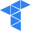 |Tradovate | <a href="https://doc.stocksharp.com/zh/topics/api/connectors/stock_market/tradovate.html" target="_blank">Docs</a> |
| |TradeStation | <a href="https://doc.stocksharp.com/zh/topics/api/connectors/stock_market/tradestation.html" target="_blank">Docs</a> |
| |TradeLocker | <a href="https://doc.stocksharp.com/zh/topics/api/connectors/stock_market/tradelocker.html" target="_blank">文档</a> |
| |tastytrade | <a href="https://doc.stocksharp.com/zh/topics/api/connectors/stock_market/tastytrade.html" target="_blank">文档</a> |
| |TradeZero | <a href="https://doc.stocksharp.com/zh/topics/api/connectors/stock_market/tradezero.html" target="_blank">Docs</a> |
| |Webull | <a href="https://doc.stocksharp.com/zh/topics/api/connectors/stock_market/webull.html" target="_blank">Docs</a> |
| |Angel One SmartAPI | <a href="https://doc.stocksharp.com/zh/topics/api/connectors/stock_market/angelone.html" target="_blank">Docs</a> |
| |DhanHQ v2 | <a href="https://doc.stocksharp.com/zh/topics/api/connectors/stock_market/dhan.html" target="_blank">Docs</a> |
| |FYERS API v3 | <a href="https://doc.stocksharp.com/zh/topics/api/connectors/stock_market/fyers.html" target="_blank">Docs</a> |
| |ICICI Direct Breeze API | <a href="https://doc.stocksharp.com/zh/topics/api/connectors/stock_market/breeze.html" target="_blank">Docs</a> |
| |Upstox | <a href="https://doc.stocksharp.com/zh/topics/api/connectors/stock_market/upstox.html" target="_blank">Docs</a> |
| |Zhongtai XTP | <a href="https://doc.stocksharp.com/zh/topics/api/connectors/stock_market/xtp.html" target="_blank">Docs</a> |
|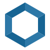 |CTP | <a href="https://doc.stocksharp.com/zh/topics/api/connectors/stock_market/ctp.html" target="_blank">Docs</a> |
|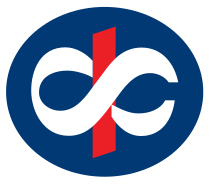 |Kotak Neo Trade API v2 | <a href="https://doc.stocksharp.com/zh/topics/api/connectors/stock_market/kotak_neo.html" target="_blank">Docs</a> |
| |Tiger Brokers OpenAPI | <a href="https://doc.stocksharp.com/zh/topics/api/connectors/stock_market/tiger_brokers.html" target="_blank">Docs</a> |
| |Saxo OpenAPI | <a href="https://doc.stocksharp.com/zh/topics/api/connectors/stock_market/saxo.html" target="_blank">Docs</a> |
| |Questrade API | <a href="https://doc.stocksharp.com/zh/topics/api/connectors/stock_market/questrade.html" target="_blank">Docs</a> |
| |Longbridge OpenAPI | <a href="https://doc.stocksharp.com/zh/topics/api/connectors/stock_market/longbridge.html" target="_blank">Docs</a> |
| |CQG Web API | <a href="https://doc.stocksharp.com/zh/topics/api/connectors/stock_market/cqg_web_api.html" target="_blank">Docs</a> |
| |IG Markets API | <a href="https://doc.stocksharp.com/zh/topics/api/connectors/stock_market/ig.html" target="_blank">Docs</a> |
| |eToro Public API | <a href="https://doc.stocksharp.com/zh/topics/api/connectors/stock_market/etoro.html" target="_blank">Docs</a> |
|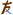 |Korea Investment & Securities Open API | <a href="https://doc.stocksharp.com/zh/topics/api/connectors/stock_market/korea_investment.html" target="_blank">Docs</a> |
| |Kiwoom REST API | <a href="https://doc.stocksharp.com/zh/topics/api/connectors/stock_market/kiwoom.html" target="_blank">Docs</a> |
|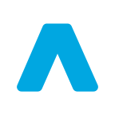 |Trading 212 | <a href="https://doc.stocksharp.com/zh/topics/api/connectors/stock_market/trading212.html" target="_blank">Docs</a> |
|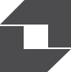 |Daishin CYBOS Plus | <a href="https://doc.stocksharp.com/zh/topics/api/connectors/stock_market/daishin.html" target="_blank">Docs</a> |
| |Capital Futures API | <a href="https://doc.stocksharp.com/zh/topics/api/connectors/stock_market/capital_futures.html" target="_blank">Docs</a> |
|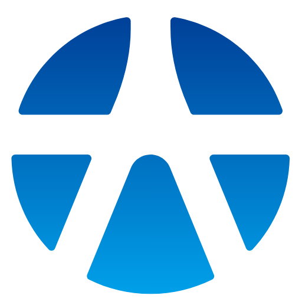 |Yuanta SPARK API | <a href="https://doc.stocksharp.com/zh/topics/api/connectors/stock_market/yuanta.html" target="_blank">Docs</a> |
|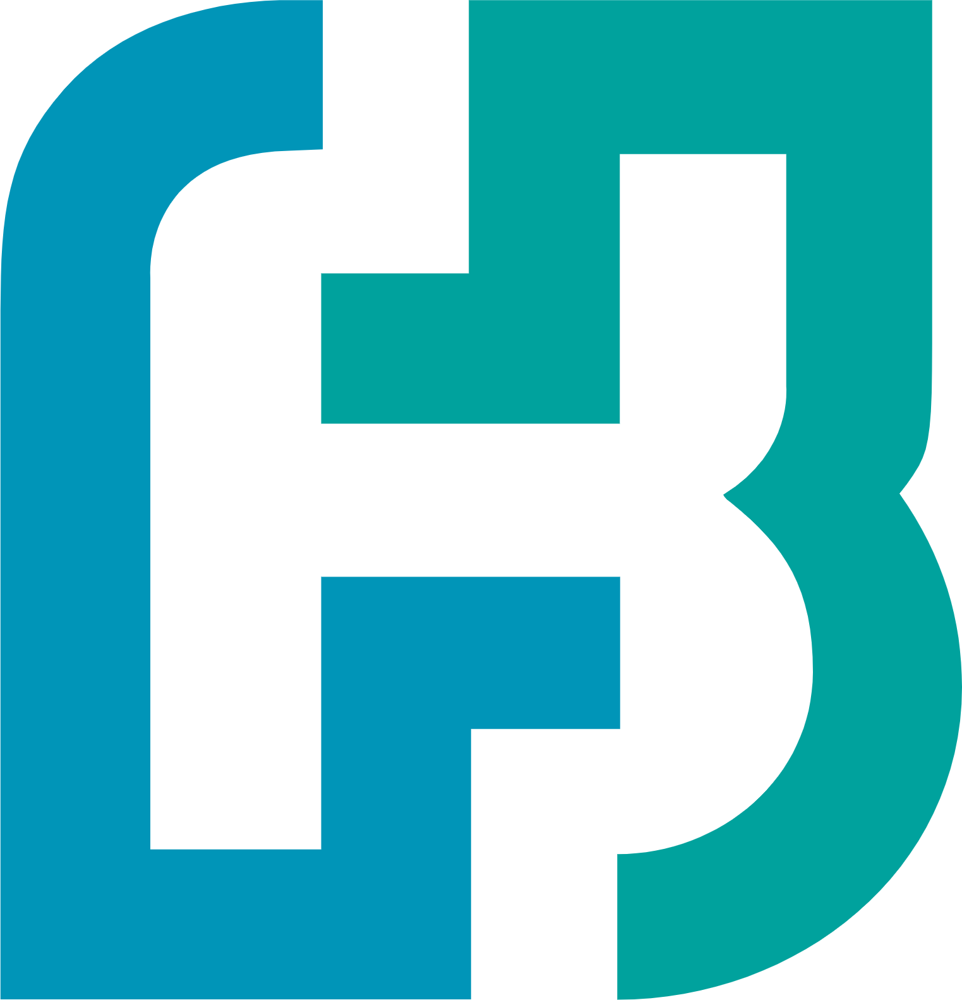 |Fubon Neo API | <a href="https://doc.stocksharp.com/zh/topics/api/connectors/stock_market/fubon_neo.html" target="_blank">Docs</a> |
|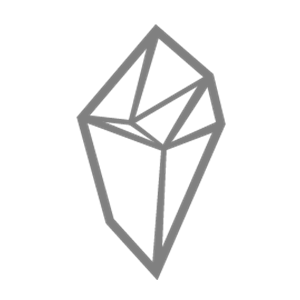 |SinoPac Shioaji | <a href="https://doc.stocksharp.com/zh/topics/api/connectors/stock_market/shioaji.html" target="_blank">Docs</a> |
| |Fugle Market Data API | <a href="https://doc.stocksharp.com/zh/topics/api/connectors/stock_market/fugle.html" target="_blank">Docs</a> |
| |Flattrade Pi API | <a href="https://doc.stocksharp.com/zh/topics/api/connectors/stock_market/flattrade.html" target="_blank">Docs</a> |
| |Alice Blue ANT API | <a href="https://doc.stocksharp.com/zh/topics/api/connectors/stock_market/alice_blue.html" target="_blank">Docs</a> |
| |Shoonya API | <a href="https://doc.stocksharp.com/zh/topics/api/connectors/stock_market/shoonya.html" target="_blank">Docs</a> |
| |Motilal Oswal MO API | <a href="https://doc.stocksharp.com/zh/topics/api/connectors/stock_market/motilal_oswal.html" target="_blank">Docs</a> |
|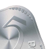 |5paisa Xstream | <a href="https://doc.stocksharp.com/zh/topics/api/connectors/stock_market/fivepaisa.html" target="_blank">Docs</a> |
| |QMT / MiniQMT / XtQuant | <a href="https://doc.stocksharp.com/zh/topics/api/connectors/stock_market/qmt.html" target="_blank">Docs</a> |
| |LSEG Real-Time | <a href="https://doc.stocksharp.com/zh/topics/api/connectors/stock_market/lseg_real_time.html" target="_blank">Docs</a> |
| |Bloomberg | <a href="https://doc.stocksharp.com/zh/topics/api/connectors/stock_market/bloomberg.html" target="_blank">Docs</a> |
| |Databento | <a href="https://doc.stocksharp.com/zh/topics/api/connectors/stock_market/databento.html" target="_blank">Docs</a> |
| |dxFeed | <a href="https://doc.stocksharp.com/zh/topics/api/connectors/stock_market/dxfeed.html" target="_blank">Docs</a> |
| |Swissquote | <a href="https://doc.stocksharp.com/zh/topics/api/connectors/stock_market/swissquote.html" target="_blank">Docs</a> |
|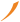 |Mirae Asset Sharekhan | <a href="https://doc.stocksharp.com/zh/topics/api/connectors/stock_market/mirae_asset_sharekhan.html" target="_blank">Docs</a> |
| |LS Securities Open API | <a href="https://doc.stocksharp.com/zh/topics/api/connectors/stock_market/ls_securities.html" target="_blank">Docs</a> |
| |Zerodha Kite Connect | <a href="https://doc.stocksharp.com/zh/topics/api/connectors/stock_market/zerodha.html" target="_blank">Docs</a> |
| |Capital.com API | <a href="https://doc.stocksharp.com/zh/topics/api/connectors/stock_market/capitalcom.html" target="_blank">Docs</a> |
| |Mitsubishi UFJ eSmart kabu Station API | <a href="https://doc.stocksharp.com/zh/topics/api/connectors/stock_market/kabu_station.html" target="_blank">Docs</a> |
| |Rakuten MARKETSPEED II RSS | <a href="https://doc.stocksharp.com/zh/topics/api/connectors/stock_market/rakuten_rss.html" target="_blank">文档</a> |
| |Groww Trading API | <a href="https://doc.stocksharp.com/zh/topics/api/connectors/stock_market/groww.html" target="_blank">Docs</a> |
| |Goldman Sachs Marquee | <a href="https://doc.stocksharp.com/zh/topics/api/connectors/stock_market/marquee.html" target="_blank">Docs</a> |
| |J.P. Morgan DataQuery | <a href="https://doc.stocksharp.com/zh/topics/api/connectors/stock_market/jpm_dataquery.html" target="_blank">文档</a> |
| |FactSet Prices | <a href="https://doc.stocksharp.com/zh/topics/api/connectors/stock_market/factset.html" target="_blank">文档</a> |
| |Morningstar Direct Web Services | <a href="https://doc.stocksharp.com/zh/topics/api/connectors/stock_market/morningstar.html" target="_blank">文档</a> |
| |S&P Global Commodity Insights | <a href="https://doc.stocksharp.com/zh/topics/api/connectors/stock_market/sp_global_commodity_insights.html" target="_blank">文档</a> |
|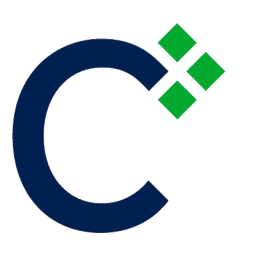 |Cboe DataShop / LiveVol | <a href="https://doc.stocksharp.com/zh/topics/api/connectors/stock_market/cboe_datashop.html" target="_blank">文档</a> |
| |Nasdaq Data Link | <a href="https://doc.stocksharp.com/zh/topics/api/connectors/stock_market/nasdaq_data_link.html" target="_blank">文档</a> |
| |Nasdaq Cloud Data Service | <a href="https://doc.stocksharp.com/zh/topics/api/connectors/stock_market/nasdaq_cloud_data_service.html" target="_blank">文档</a> |
| |Intrinio | <a href="https://doc.stocksharp.com/zh/topics/api/connectors/stock_market/intrinio.html" target="_blank">文档</a> |
| |Finnhub | <a href="https://doc.stocksharp.com/zh/topics/api/connectors/stock_market/finnhub.html" target="_blank">文档</a> |
|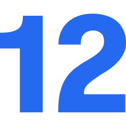 |Twelve Data | <a href="https://doc.stocksharp.com/zh/topics/api/connectors/stock_market/twelvedata.html" target="_blank">文档</a> |
| |Tiingo | <a href="https://doc.stocksharp.com/zh/topics/api/connectors/stock_market/tiingo.html" target="_blank">文档</a> |
| |EOD Historical Data | <a href="https://doc.stocksharp.com/zh/topics/api/connectors/stock_market/eodhd.html" target="_blank">文档</a> |
|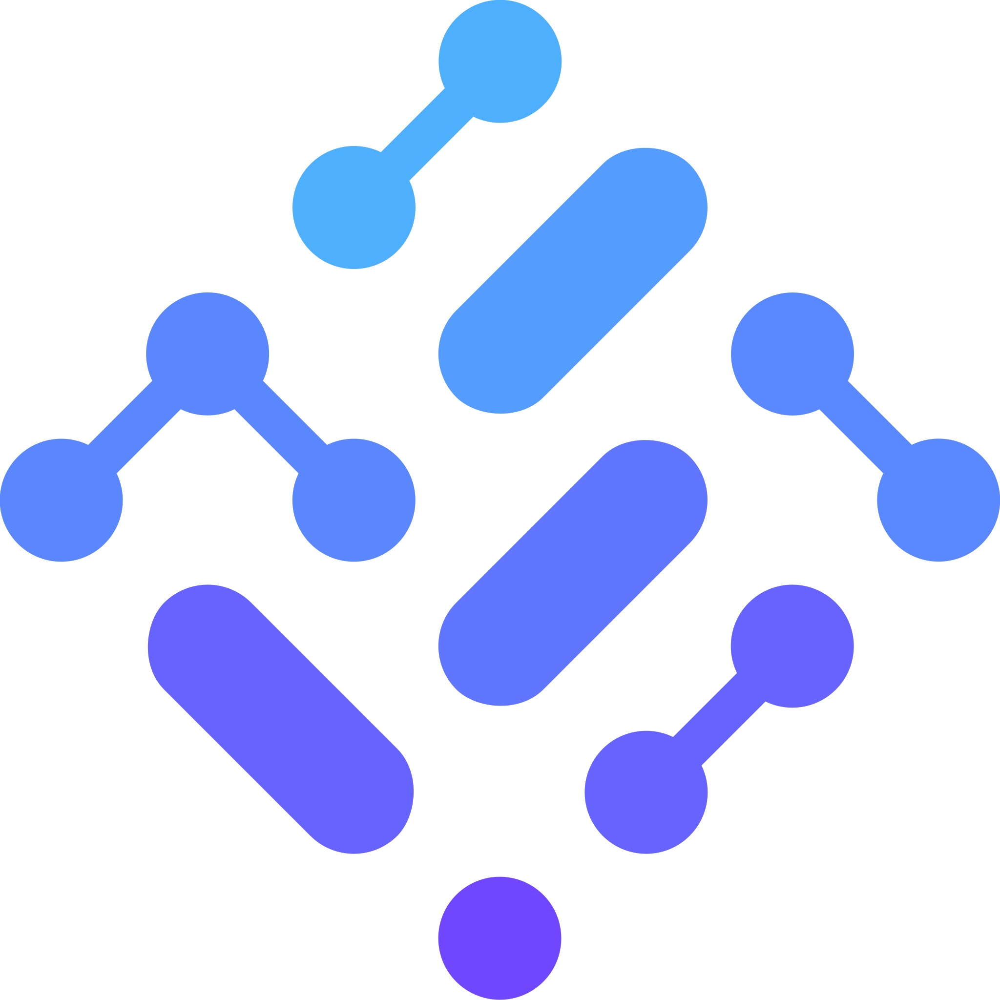 |Financial Modeling Prep | <a href="https://doc.stocksharp.com/zh/topics/api/connectors/stock_market/fmp.html" target="_blank">文档</a> |
| |Marketstack | <a href="https://doc.stocksharp.com/zh/topics/api/connectors/stock_market/marketstack.html" target="_blank">文档</a> |
| |ThetaData | <a href="https://doc.stocksharp.com/zh/topics/api/connectors/stock_market/thetadata.html" target="_blank">文档</a> |
|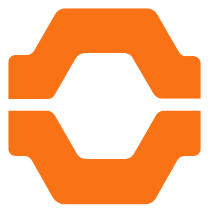 |ORATS | <a href="https://doc.stocksharp.com/zh/topics/api/connectors/stock_market/orats.html" target="_blank">文档</a> |
| |OptionMetrics IvyDB | <a href="https://doc.stocksharp.com/zh/topics/api/connectors/stock_market/optionmetrics.html" target="_blank">文档</a> |
| |AlgoSeek | <a href="https://doc.stocksharp.com/zh/topics/api/connectors/stock_market/algoseek.html" target="_blank">文档</a> |
| |Exegy | <a href="https://doc.stocksharp.com/zh/topics/api/connectors/stock_market/exegy.html" target="_blank">文档</a> |
| |QUODD | <a href="https://doc.stocksharp.com/zh/topics/api/connectors/stock_market/quodd.html" target="_blank">文档</a> |
| |ACTIV Financial | <a href="https://doc.stocksharp.com/zh/topics/api/connectors/stock_market/activ_financial.html" target="_blank">文档</a> |
|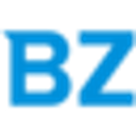 |Benzinga | <a href="https://doc.stocksharp.com/zh/topics/api/connectors/stock_market/benzinga.html" target="_blank">文档</a> |
|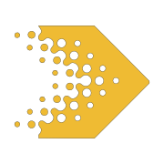 |RavenPack | <a href="https://doc.stocksharp.com/zh/topics/api/connectors/stock_market/ravenpack.html" target="_blank">文档</a> |
| |Dow Jones | <a href="https://doc.stocksharp.com/zh/topics/api/connectors/stock_market/dow_jones.html" target="_blank">文档</a> |
| |MT Newswires | <a href="https://doc.stocksharp.com/zh/topics/api/connectors/stock_market/mt_newswires.html" target="_blank">文档</a> |
| |BMLL | <a href="https://doc.stocksharp.com/zh/topics/api/connectors/stock_market/bmll.html" target="_blank">文档</a> |
| |FIX protocol (4.2, 4.4. 5.0) | <a href="https://doc.stocksharp.com/zh/topics/api/connectors/stock_market/fix_protocol.html" target="_blank">Docs</a> |
| |FAST protocol | <a href="https://doc.stocksharp.com/zh/topics/api/connectors/common/fast_protocol.html" target="_blank">Docs</a> |
| |Sierra Chart DTC | <a href="https://doc.stocksharp.com/zh/topics/api/connectors/common/sierra_chart_dtc.html" target="_blank">Docs</a> |
| |BVMT | <a href="https://doc.stocksharp.com/zh/topics/api/connectors/stock_market/bvmt.html" target="_blank">Docs</a> |
| |AlphaVantage | <a href="https://doc.stocksharp.com/zh/topics/api/connectors/stock_market/alphavantage.html" target="_blank">Docs</a> |
| |BarChart | <a href="https://doc.stocksharp.com/zh/topics/api/connectors/stock_market/barchart.html" target="_blank">Docs</a> |
| |CQG | <a href="https://doc.stocksharp.com/zh/topics/api/connectors/stock_market/cqg.html" target="_blank">Docs</a> |
| |E*TRADE | <a href="https://doc.stocksharp.com/zh/topics/api/connectors/stock_market/e_trade.html" target="_blank">Docs</a> |
| |Google | <a href="https://doc.stocksharp.com/zh/topics/api/connectors/stock_market/google.html" target="_blank">Docs</a> |
| |IEX | <a href="https://doc.stocksharp.com/zh/topics/api/connectors/stock_market/iex.html" target="_blank">Docs</a> |
| |IQFeed | <a href="https://doc.stocksharp.com/zh/topics/api/connectors/stock_market/iqfeed.html" target="_blank">Docs</a> |
| |ITCH | <a href="https://doc.stocksharp.com/zh/topics/api/connectors/stock_market/itch.html" target="_blank">Docs</a> |
| |OpenECry | <a href="https://doc.stocksharp.com/zh/topics/api/connectors/stock_market/openecry.html" target="_blank">Docs</a> |
| |Quandl | <a href="https://doc.stocksharp.com/zh/topics/api/connectors/stock_market/quandl.html" target="_blank">Docs</a> |
| |QuantFEED | <a href="https://doc.stocksharp.com/zh/topics/api/connectors/stock_market/quantfeed.html" target="_blank">Docs</a> |
| |Rithmic | <a href="https://doc.stocksharp.com/zh/topics/api/connectors/stock_market/rithmic.html" target="_blank">Docs</a> |
| |Robinhood | <a href="https://doc.stocksharp.com/zh/topics/api/connectors/stock_market/robinhood.html" target="_blank">Docs</a> |
|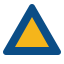 |Sterling | <a href="https://doc.stocksharp.com/zh/topics/api/connectors/stock_market/sterling.html" target="_blank">Docs</a> |
| |Tradier | <a href="https://doc.stocksharp.com/zh/topics/api/connectors/stock_market/tradier.html" target="_blank">Docs</a> |
| |Xignite | <a href="https://doc.stocksharp.com/zh/topics/api/connectors/stock_market/xignite.html" target="_blank">Docs</a> |
| |Yahoo | <a href="https://doc.stocksharp.com/zh/topics/api/connectors/stock_market/yahoo.html" target="_blank">Docs</a> |
| |Blackwood (Fusion) | <a href="https://doc.stocksharp.com/zh/topics/api/connectors/stock_market/blackwood_fusion.html" target="_blank">Docs</a> |

*[所有股票交易所的完整列表 - 请参阅英文版 README](README.md#stock-futures-and-options)*

## 外汇
|图标 | 名称 | 文档|
|:---:|:----:|:------:|
| |DXtrade | <a href="https://doc.stocksharp.com/zh/topics/api/connectors/forex/dxtrade.html" target="_blank">Docs</a> |
| |cTrader | <a href="https://doc.stocksharp.com/zh/topics/api/connectors/forex/ctrader.html" target="_blank">Docs</a> |
| |Match-Trader | <a href="https://doc.stocksharp.com/zh/topics/api/connectors/forex/matchtrader.html" target="_blank">Docs</a> |
|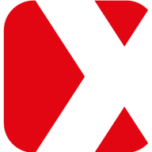 |X Open Hub | <a href="https://doc.stocksharp.com/zh/topics/api/connectors/forex/xopenhub.html" target="_blank">Docs</a> |
| |MT4 | <a href="https://doc.stocksharp.com/zh/topics/api/connectors/forex/metatrader.html" target="_blank">Docs</a> |
| |MT5 | <a href="https://doc.stocksharp.com/zh/topics/api/connectors/forex/metatrader.html" target="_blank">Docs</a> |
| |DukasCopy | <a href="https://doc.stocksharp.com/zh/topics/api/connectors/forex/dukascopy.html" target="_blank">Docs</a> |
| |FXCM | <a href="https://doc.stocksharp.com/zh/topics/api/connectors/forex/fxcm.html" target="_blank">Docs</a> |
| |LMAX | <a href="https://doc.stocksharp.com/zh/topics/api/connectors/forex/lmax.html" target="_blank">Docs</a> |
| |Oanda | <a href="https://doc.stocksharp.com/zh/topics/api/connectors/forex/oanda.html" target="_blank">Docs</a> |

  [1]: https://stocksharp.com/zh
  [4]: https://stocksharp.com/zh/edu/
  [5]: https://stocksharp.com/zh/forum/
  [6]: https://stocksharp.com/zh/broker/
  [8]: https://stocksharp.com/zh/store/strategy-designer/
  [9]: https://stocksharp.com/zh/store/market-data-downloader/
  [10]: https://stocksharp.com/zh/store/trading-terminal/
  [11]: https://stocksharp.com/zh/store/trading-shell/
  [12]: https://stocksharp.com/zh/store/api/
